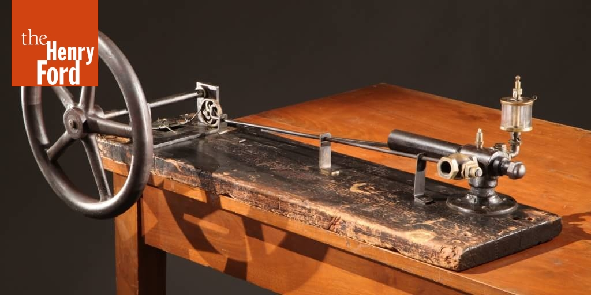

# Farmer's Table

*Henry Ford tried his first experimental engine, pictured here, after eating dinner on Christmas Eve on 1893. Photo courtesy of [The Henry Ford museum](https://www.thehenryford.org/collections-and-research/digital-collections/artifact/224715/).*

## Abstract

Henry Ford, born on a Michigan farm in 1863, never lost touch with his rural roots—even as he revolutionized global industry. His obsession with mechanical innovation began at the table of his farm house, where he dismantled and rebuilt machines to understand their inner workings. Unlike contemporaries who favored electric or steam power, Ford saw gasoline as the most practical path to widespread mobility. His vision was not just of a car for the elite, but of a “motorcar for the great multitude.”

Ford's ingenuity and tenacity were evident in his relentless experimentation. After several failed ventures, he founded the Ford Motor Company in 1903 and, by 1908, introduced the Model T. Its affordable price, durable design, and compatibility with rural life made it a transformative tool for farmers and workers alike. He further revolutionized manufacturing with the moving assembly line, drastically reducing production time and cost.

Beyond his success as an industrialist, Ford’s legacy lies in democratizing technology. His vision redefined the American landscape—geographically, economically, and culturally.

## Discussion points

*

## Reading and media

*
