# Inventing A City

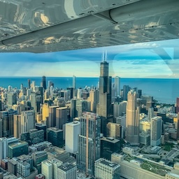 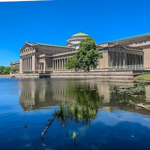 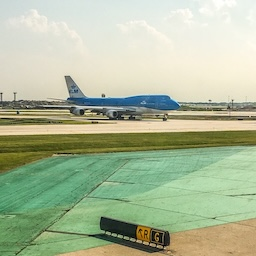 

*Chicago's skyline from 1000 ft above the ground (left). The Columbian Basin south of the Museum of Science and Industry in Hyde Park (center). A KLM 747 taxing at O'Hare Airport (right).* [All photos by Leo Irakliotis.]

**Preamble.** There is no such thing as a perfect city (or state). They are what we make of them: with our work, with our friendships, and with our imagination. As a living experiment, Chicago is imperfect, resilient, and unfinished. What endures is not the skyline or the slogan, but the habits of care we practice daily: how we welcome strangers, educate children, build institutions, and choose, again and again, to invest in a shared future. In the end, a city’s greatness is measured less by its monuments than by its commitments to opportunity, to dignity, and to the quiet, stubborn work of making common life better for the next generation. LI.

## Abstract

After the Great Fire of 1871 devastated much of Chicago, the city embarked on one of the most ambitious rebuilding projects in American history—an effort that transformed it from a smoldering ruin into a modern industrial and cultural powerhouse. Central to this reinvention was Daniel Burnham, whose 1909 Plan of Chicago laid the blueprint for a visionary, orderly metropolis. With wide boulevards, lakefront parks, civic centers, and infrastructure to support growth, Burnham’s plan fused aesthetics with utility, shaping both the physical and aspirational contours of the city.

Meanwhile, the industrial boom fueled Chicago’s rise. Entrepreneurs and industrialists like George Pullman, Philip Armour, and Joseph Ryerson built factories, stockyards, and rail hubs that turned the city into a nerve center of production and distribution. Pullman's model town for his workers symbolized both the idealism and the tensions of industrial capitalism. Armour’s meatpacking empire and Ryerson’s steel operations fed the city's expanding economy, attracting waves of immigrants who powered its factories and filled its neighborhoods.

By the early 20th century, Chicago had reinvented itself as a premier American metropolis—defined by its towering architecture, cultural institutions, and economic might. It became a city of firsts: in skyscrapers, in organized labor movements, in jazz and blues, and in political influence.

The “invention of Chicago” was not just about rebuilding. It was about reimagining what a city could be. Guided by bold planning and driven by industrial ambition, Chicago emerged as a symbol of resilience, innovation, and the modern American urban experience.

**<mark>[Reading material is available](https://github.com/lgreco/InventingTheFuture/blob/main/topics/inventing_a_city.md#reading-topics) after the following list of discussion points.</mark>**

## Discussion points: Chicago as an Invented City

### 1) Chicago as a National System, Not Just a City

**Setup:** Chicago’s rise is inseparable from its role as a connector—of regions, markets, people, and infrastructures. One way to read Chicago is as an interface for the American interior, translating geography into economic and political power.

**Discussion questions**

* If New York is “finance” and L.A. is “media,” what is Chicago’s primary role in modern U.S. life—and has it shifted over time?
* Is Chicago better understood as a city or as a *platform* (logistics, labor, governance) that scales nationally?
* What features of Chicago’s historical trajectory make it a useful “model” for understanding American modernity?

**Evidence prompts**

* **Fire:** rebuilding as a deliberate reinvention, not simply recovery
* **Burnham:** the idea of the metropolis as a planned civic instrument
* **Transportation/industry references inside Pullman/Armour:** the distribution logic that made Chicago central

### 2) Disaster, Regulation, and Reinvention

**Setup:** Chicago’s most celebrated innovation stories are often triggered by crisis. This cluster asks whether catastrophe is truly a civic “reset” or whether it accelerates existing inequalities and power structures.

**Discussion questions**

* After 1871, who benefited most from rebuilding, and who was displaced or left behind?
* How do building codes, insurance, and capital markets shape “innovation” as much as engineering does?
* Compare the Fire to later shocks (racial conflict, industrial accidents, civic violence): why do some crises produce redesign while others produce long-term damage?

**Evidence prompts**

* **Fire:** scale of destruction, building codes, material changes, rebound narratives
* **Dark moments:** patterns of crisis revealing structural strain (1919; Eastland; Haymarket

### 3) Planning, Power, and the Burnham Vision

**Setup:** Burnham’s Plan of Chicago fused beauty and utility—parks, boulevards, civic centers, and infrastructure. But planning is never neutral; it distributes access, mobility, and legitimacy.

**Discussion questions**

* Is Burnham best read as democratic civic imagination or elite control—or both?
* Lakefront parks: public good, land-value engine, symbolic nation-building, or all three?
* What would a “Burnham-scale” plan look like today: climate resilience, housing, transit, regional governance?

**Evidence prompts**

* **Burnham:** 1909 plan as blueprint for an orderly metropolis
* **World’s Fair:** Chicago presenting itself as globally modern
* **Fire:** rebuilding momentum enabling large-scale re-imagining

### 4) Chicago’s Innovation Stack: From Steel to Systems

**Setup:** Chicago’s transformation wasn’t just industrial growth; it was technological and organizational innovation—new materials, supply chains, infrastructures, and managerial systems that scaled the city into a global metropolis.

**Discussion questions**

* What counts as “technology” in Chicago’s history: machines, infrastructure, media, organizational design?
* Skyscrapers as *financial* and *engineering* innovation: what did building upward enable socially and economically?
* Is Chicago an early “systems city”—optimizing flows of goods, workers, and information?

**Evidence prompts**

* **Fire:** architectural experimentation and modern building practices
* **Pullman/Armour:** refrigerated distribution, industrial organization, the factory city
* **Burnham:** infrastructure as an engine of growth, not merely a response to growth

### 5) Labor, Capital, and the Social Cost of Efficiency

**Setup:** Chicago’s industrial might produced wealth and national influence, but also concentrated risk and conflict: labor exploitation, strike politics, workplace hazards, and regulatory dilemmas.

**Discussion questions**

* Make the case that Chicago’s rise required organized labor—and then make the case that it required labor exploitation.
* Pullman: is the company town an idealist social experiment or a mechanism of control?
* Haymarket: why did Chicago become the emblematic battleground for labor and state power?

**Evidence prompts**

* **Pullman/Armour:** model town tensions; meatpacking scale vs labor conditions
* **Dark moments:** Haymarket as industrial conflict made visible
* **Fire:** rebuilding economy and labor demand accelerating urban growth

### 6) Immigration and Neighborhood Formation: City-Building from Below

**Setup:** Chicago’s nineteenth-century growth was an immigrant story—workers, families, institutions, and neighborhoods. Immigration built both the labor force and the social infrastructure that made city life workable.

**Discussion questions**

* What mattered more to Chicago’s growth: immigrant labor or immigrant institutions (churches, newspapers, mutual aid, settlement houses)?
* Ethnic enclaves: engines of opportunity, engines of segregation, or both?
* How did immigration reshape politics (wards, patronage, reform movements) and urban identity?

**Evidence prompts**

* **Immigration:** demographic dominance of foreign-born Chicago, neighborhood clustering
* **Jane Addams/Hull House:** settlement house responses to immigrant life
* **Fire:** rebuilding pull-factor and labor demand

### 7) The Great Migration, Segregation, and the Geography of Inequality

**Setup:** Chicago becomes a key case study for how opportunity and constraint coexist. The Great Migration expanded economic and cultural life, yet the city also constructed durable forms of racial segregation through housing, labor markets, and urban boundaries.

**Discussion questions**

* How can Chicago be both a “Promised Land” and a segregation machine?
* What roles did industry, housing markets, and policy play in shaping Black settlement patterns?
* How do the legacies of early twentieth-century segregation still structure Chicago today?

**Evidence prompts**

* **Great Migration:** labor pull, neighborhood boundaries, institutions like the Defender
* **Dark moments:** 1919 riot as a flashpoint revealing underlying structures
* **Movers (Ida B. Wells, Brooks, Washington):** civic/cultural/political consequences of migration

### 8) The Great Lakes Metropolis: Region, Future, and Responsibility

**Setup:** Chicago’s future may be less about city limits and more about the Great Lakes urban system—freight, water, climate pressures, and interdependent metro regions. This cluster pushes students from “history of Chicago” to “Chicago’s next century.”

**Discussion questions**

* Is Chicago best understood as the anchor of a Great Lakes conurbation (Milwaukee–Chicago–NW Indiana) rather than a standalone city?
* Climate and water security: does Chicago’s strategic advantage grow—and what responsibilities follow?
* What should Chicago prioritize to remain a global metropolis: transit modernization, housing affordability, climate resilience, or regional coordination?

**Evidence prompts**

* **Burnham:** long-horizon planning as civic identity
* **Fire:** reinvention narratives—what would “rebuilding” mean now?
* **Dark moments:** crises as stress tests (what future stress tests are coming?)

---

## Reading topics

### A Bubbly Creek

Where else can you find something like this but Chicago? A smelly river that *bubbles* — not from geothermal springs or volcanic vents — but from decomposing animal waste. Only in the city that industrialized everything, including gravity and water flow, could you produce a creek so saturated with the byproducts of capitalism that it literally effervesced.

Welcome to **Bubbly Creek**, a branch of the South Fork of the Chicago River that runs along what was once the Union Stock Yards. In the late nineteenth and early twentieth centuries, this stretch of water became the unofficial holding tank for America’s appetite. Slaughterhouses lining the banks of the yards processed millions of cattle and hogs annually. The blood, fat, entrails, and chemical waste that could not be rendered or sold were simply discharged into the river. The result: a thick stew of organic refuse that, as it decomposed anaerobically, released methane and other gases. The surface churned. The water burped. Hence the name.

Chicago’s reputation as the “hog butcher for the world” was not metaphorical. The Union Stock Yards were the epicenter of modern meatpacking — an industrial symphony of disassembly lines, refrigeration, rail transport, and global distribution. Firms like Armour and Swift perfected vertical integration and industrial efficiency. They also perfected externalization. The waste flowed downhill — into the creek.

The reversal of the Chicago River in 1900, often celebrated as a triumph of civil engineering, did not immediately redeem Bubbly Creek. By then, decades of animal byproduct had accumulated in layers of sediment on the creek bed. Even after waste dumping was curtailed, decomposition continued below the surface, producing gases that kept the water in a perpetual state of agitation. For years, bubbles rose through a slick of grease and foam — industrial digestion made visible.

Upton Sinclair’s *The Jungle* (1906) captured the human side of this system. While Sinclair focused on labor exploitation, contamination, and corporate indifference inside the plants, Bubbly Creek functioned as an environmental epilogue to his story. What was unsellable inside the packinghouses migrated outward — into water, into neighborhoods, into public health. The same industrial efficiency that lowered meat prices for the nation concentrated risk along the South Side.

And yet, the story grows more complicated. During the Great Depression, when unemployment and hunger gripped Chicago’s working-class communities, families reportedly harvested food from Bubbly Creek. Animal parts and scraps — fats, bones, and occasionally usable cuts — floated to the surface. Residents skimmed what they could. It is difficult to imagine a clearer symbol of industrial modernity’s paradox: abundance at national scale, scarcity at neighborhood scale.

The creek thus embodies the logic of early industrial Chicago. It reveals the hidden costs of scale — how efficiency in production often depends upon invisibility in disposal. It also reflects the city’s capacity for reinvention. Today, restoration efforts aim to rehabilitate the South Fork’s ecology. Organizations work to reintroduce habitat and improve water quality, reframing a site of environmental neglect as a laboratory for urban ecological repair.

Bubbly Creek may provoke laughter at first — a river that bubbles! — but its history invites reflection. It is a reminder that the making of a modern metropolis is never clean. Chicago’s genius lay in organizing flows — of grain, freight, labor, and meat. Bubbly Creek shows us what happens to the flows that cannot be organized profitably.

---

### Chicago and the Great Lakes Megalopolis

The modern city of Chicago is best understood not merely as a large metropolitan center, but as a dominant node within a broader continental urban system: the Great Lakes megalopolis. This region—stretching from Milwaukee and Chicago through Detroit, Cleveland, Toronto, and into the industrial corridor of the lower Great Lakes—constitutes one of the largest concentrations of population, economic output, and infrastructure in North America. To describe Chicago’s role within this formation is to shift analytical scale: from city to region, from municipality to network.

The concept of the “megalopolis,” popularized in the twentieth century, captures precisely this scale of analysis. Rather than discrete, self-contained cities, modern urbanization often produces extended corridors of interdependent metropolitan areas linked by transportation, industry, and communication. In the Great Lakes basin, industrialization, inland waterways, rail convergence, and later highway and air networks fused multiple cities into a functionally integrated zone. Chicago emerged as the principal inland hub of this system. Its geographic position at the southwestern edge of Lake Michigan—connecting Great Lakes shipping to Mississippi River watersheds via canal and river engineering—made it the logistical pivot between eastern manufacturing centers and the agricultural and resource-rich interior of the continent.

The theoretical foundations for understanding such formations can be traced to planners such as Constantinos Apostolou Doxiadis, whose work in ekistics—the science of human settlements—emphasized that urbanization evolves beyond traditional city boundaries into regional and transregional systems. In this view, Chicago is not simply a municipality of roughly 2.7 million residents, but the organizing nucleus of a much larger settlement pattern structured by flows of freight, labor, capital, and information. Its freight rail yards handle a disproportionate share of North American rail traffic; its airports serve as continental transfer points; and its financial, legal, and corporate institutions coordinate economic activity well beyond Illinois.

Within the Great Lakes megalopolis, Chicago functions as both connector and command center. It anchors the southern tier of the Lakes, balancing Toronto’s prominence in Canada and complementing Detroit’s historic automotive specialization. The regional economy has evolved from heavy manufacturing toward diversified sectors—finance, logistics, higher education, health care, and advanced services—but Chicago remains the largest labor market and corporate headquarters concentration in the interior United States. Its universities, commodities exchanges, and transportation infrastructure amplify its influence across state and national borders.

At the same time, Chicago’s dominance is relational rather than isolated. Its power depends upon the shared freshwater resources of the Great Lakes, cross-border trade regimes, and coordinated infrastructure across multiple states and provinces. Environmental stewardship, climate resilience, and interregional transportation planning increasingly bind Chicago’s future to that of the entire basin. In demographic and ecological terms, the Great Lakes region may gain renewed strategic importance in a warming climate, given its freshwater abundance and moderate temperatures. Chicago’s historical role as the hinge between water systems and continental trade routes thus acquires contemporary relevance.

To describe Chicago as a dominant component of the Great Lakes megalopolis is therefore to recognize a layered reality: a city forged by nineteenth-century industrial ambition that matured into a twentieth-century regional hub and now operates as a twenty-first-century networked metropolis. Its influence radiates not because it stands alone, but because it integrates and coordinates a vast urban constellation across the Great Lakes basin.

1. *Megalopolis (city type)* — Wikipedia
   [https://en.wikipedia.org/wiki/Megalopolis](https://en.wikipedia.org/wiki/Megalopolis)

2. *Great Lakes megalopolis* — Wikipedia
   [https://en.wikipedia.org/wiki/Great_Lakes_megalopolis](https://en.wikipedia.org/wiki/Great_Lakes_megalopolis)

3. *Constantinos Apostolou Doxiadis* — Wikipedia
   [https://en.wikipedia.org/wiki/Constantinos_Apostolou_Doxiadis](https://en.wikipedia.org/wiki/Constantinos_Apostolou_Doxiadis)

---

### The Great Chicago Fire of 1871: Disaster and Urban Reinvention

[The Great Chicago Fire](https://www.wttw.com/chicago-stories/chicago-fire), a WTTW story.

On the evening of **October 8, 1871**, a fire broke out on the southwest side of **Chicago, Illinois**, beginning what would become one of the most consequential urban conflagrations in American history. Over the next **36 hours**, the blaze consumed large swaths of the city, killing an estimated **300 people**, destroying roughly **17,000–18,000 buildings**, and leaving **nearly 100,000 residents homeless** out of a population of approximately 330,000. The disaster erased more than **3.3 square miles** of urban fabric, including the central business district, residential areas, and city infrastructure. Although the iconic legend of **Mrs. O’Leary’s cow knocking over a lantern** has endured, the true cause of the fire has never been definitively established. ([Wikipedia][1])

The conflagration’s rapid spread was the product of a perfect storm of environmental and structural conditions. Months of drought had left the city, then largely constructed of wood—including buildings, sidewalks, and streets—exceptionally dry and combustible. A strong southwest wind fanned the flames, pushing them block by block through neighbourhoods already prone to frequent smaller fires. The city’s under-funded firefighting force, with only about 185 firefighters and limited equipment, was quickly overwhelmed. Even stone and brick buildings were consumed as the inferno advanced, fed by wooden interiors and rooftops. ([Library Guides][2])

The immediate aftermath was catastrophic: a third of Chicago lay in ruins, commercial life was disrupted, and tens of thousands faced destitution. Martial law was declared to maintain order in the chaotic days immediately following the fire. Yet almost as quickly as the flames were extinguished—assisted by a fortuitous rainstorm—the city’s leadership and business community set to work on **reconstruction**. ([HISTORY][3])

What followed in the subsequent decade was not merely rebuilding but **reinvention**. Chicago recognized that its vulnerability to fire stemmed from its rapid, unplanned growth and lax building standards. New building codes were adopted that emphasized **non-combustible materials**, fireproofing, and disciplined urban design. Architects and engineers seized the opportunity to experiment with emerging technologies and forms, laying the intellectual and material foundations for what would become the **modern skyscraper**. By 1880, the city’s population had rebounded to approximately 500,000, and by 1890 it had surpassed **one million residents**, second only to New York in size among American cities. ([Chicago Architecture Center][4])

This architectural and economic renaissance was emblematic of a wider civic transformation. Chicago’s leaders, including business magnates, civic planners, and elected officials, promoted a narrative of recovery and progress that helped attract investors, migrants, and visitors. In 1893, barely twenty-two years after the fire, Chicago hosted the **World’s Columbian Exposition**, which drew millions of visitors and showcased the city’s achievements in urban planning, arts, and industry. The devastation of 1871, in this telling, became a **catalyst** for Chicago’s emergence as a preeminent center of American commerce, culture, and innovation. ([WTTW Chicago][5])

The fire also reshaped the city’s social and institutional landscape. Civic organizations and public infrastructure—such as the Chicago Public Library, initially funded by international book donations—grew in response to the shared sense of loss and renewal. Architectural firms that cut their teeth in the rebuilding era, such as those of **Daniel Burnham** and **Louis Sullivan**, would come to define Chicago’s skyline and influence city planning practices across the United States. ([WTTW Chicago][5])

In reflecting on the Great Chicago Fire, then, one sees a story not only of destruction but of **urban resilience** and **strategic transformation**. Chicago’s rise from the ashes was not inevitable; it was engineered through deliberate reforms in building practices, civic organization, and economic ambition. The conflagration, devastating as it was, became an inflection point in the city’s evolution from a rapidly growing frontier town to a crucible of modern American urbanism.

1. **Encyclopaedia Britannica, “Great Chicago Fire”** — concise, authoritative overview.
   [https://www.britannica.com/event/Chicago-fire-of-1871](https://www.britannica.com/event/Chicago-fire-of-1871) ([Encyclopedia Britannica][6])

2. **History.com, “Great Chicago Fire”** — narrative summary with reconstruction highlights.
   [https://www.history.com/articles/great-chicago-fire](https://www.history.com/articles/great-chicago-fire) ([HISTORY][3])

3. **National Geographic, “Chicago Fire… and the Great Rebuilding”** — focused on aftermath and urban renaissance.
   [https://education.nationalgeographic.org/resource/chicago-fire-1871-and-great-rebuilding/](https://education.nationalgeographic.org/resource/chicago-fire-1871-and-great-rebuilding/) ([National Geographic Education][7])

4. **WTTW, “Chicago Shall Rise Again…”** — interpretive account of the rebuilding process.
   [https://www.wttw.com/chicago-stories/chicago-fire/chicago-shall-rise-again-rebuilding-a-better-city-after-the-blaze](https://www.wttw.com/chicago-stories/chicago-fire/chicago-shall-rise-again-rebuilding-a-better-city-after-the-blaze) ([WTTW Chicago][5])

5. **Chicago History Museum, “How Disaster Shaped the Modern City”** — analysis of fire’s impact on urban development.
   [https://www.chicagohistory.org/how-disaster-shaped-the-modern-city/](https://www.chicagohistory.org/how-disaster-shaped-the-modern-city/) ([Chicago History Museum][8])

[1]: https://en.wikipedia.org/wiki/Great_Chicago_Fire "Great Chicago Fire"
[2]: https://guides.library.illinois.edu/c.php?g=416856&p=2840497&utm_source=chatgpt.com "Significant Illinois Fires: Great Chicago Fire"
[3]: https://www.history.com/articles/great-chicago-fire "Chicago Fire of 1871 - Great, Map & Cause"
[4]: https://www.architecture.org/online-resources/architecture-encyclopedia/the-great-chicago-fire-of-1871 "The Great Chicago Fire of 1871"
[5]: https://www.wttw.com/chicago-stories/chicago-fire/chicago-shall-rise-again-rebuilding-a-better-city-after-the-blaze "'Chicago Shall Rise Again' — Rebuilding a Better City After ..."
[6]: https://www.britannica.com/event/Chicago-fire-of-1871 "Great Chicago Fire | Cause, Deaths, & Facts"
[7]: https://education.nationalgeographic.org/resource/chicago-fire-1871-and-great-rebuilding/ "The Chicago Fire of 1871 and the 'Great Rebuilding'"
[8]: https://www.chicagohistory.org/how-disaster-shaped-the-modern-city/ "How Disaster Shaped the Modern City - Chicago History Museum"

---

### The Plan of Chicago

Daniel H. Burnham’s *Plan of Chicago* (1909), prepared with Edward H. Bennett under the auspices of the Commercial Club, represents one of the most ambitious early twentieth-century efforts to impose systematic order upon a rapidly expanding American metropolis . Conceived in the wake of the 1893 World’s Columbian Exposition, the Plan reflects a conviction that urban growth must be guided by deliberate design rather than by speculative real-estate development or piecemeal infrastructure. As outlined in the opening chapters, Burnham situates Chicago within a broader historical lineage of city planning, drawing comparisons to Paris, Rome, Vienna, and Washington in order to frame Chicago as the “metropolis of the Middle West” destined for continued expansion .

The Plan advances six principal recommendations, later summarized in its concluding chapter: (1) improvement of the lakefront; (2) creation of a regional highway system; (3) reorganization of railway terminals and freight handling; (4) acquisition of an outer park system with connecting boulevards; (5) systematic arrangement of streets within the city; and (6) development of a civic center to give coherence and symbolic unity to the metropolis . These elements reveal the Plan’s dual commitment to efficiency and beauty. Burnham repeatedly argues that practical improvements in transportation and circulation are inseparable from aesthetic order. The city, in this view, must function as an integrated organism.

Transportation occupies a central role. Chicago, Burnham notes, “has been made largely by the railroads,” and its future prosperity depends upon a unified system for handling freight and passengers . Rather than allowing twenty-two trunk lines to operate independently, the Plan proposes a coordinated traffic “clearing-house,” centralized freight yards, improved passenger terminals, and a loop system to reduce congestion . The emphasis is not merely technical; efficient transport safeguards Chicago’s competitive position within national commerce.

Equally transformative is the treatment of the lakefront. Burnham characterizes the improvement of the shore from Winnetka to the Indiana line as an “economic necessity” . Waste material from excavation and tunnel construction would be used to create new parklands, thereby converting industrial byproducts into public amenities. The lake is to be secured as a continuous public domain, framed by parkways and lagoons, rather than surrendered to private encroachment . This proposal reflects a broader Progressive-Era belief that environmental and civic improvement can reinforce economic vitality.

The park system extends beyond the shoreline. Building upon the work of the Special Park Commission, the Plan advocates an encircling belt of large parks and forest preserves, connected by boulevards and supplemented by neighborhood parks equipped with field houses and recreational facilities . Parks are justified not only as aesthetic enhancements but as instruments of public health and social cohesion, especially for residents of dense urban districts.

Within the central business district, Burnham proposes widening streets, introducing diagonal avenues, and establishing Congress Street as a grand east–west axis terminating at a monumental civic center . The civic center, conceived as a grouped ensemble of public buildings organized around a domed plaza, is intended to provide symbolic focus and architectural unity . Here the influence of Beaux-Arts principles and the memory of the Columbian Exposition are evident.

Throughout, Burnham frames the Plan as both visionary and attainable. He appeals to Chicago’s “public spirit” and growing civic education, arguing that systematic improvement is a natural progression for an advancing community . The Plan thus articulates a philosophy of urban governance: expert design, coordinated infrastructure, and aesthetic ambition combined to shape a metropolis capable of sustaining long-term growth. In this sense, the *Plan of Chicago* stands as a foundational document in American city planning, linking beauty, commerce, and public welfare within a coherent metropolitan strategy.

---

### A Model Community

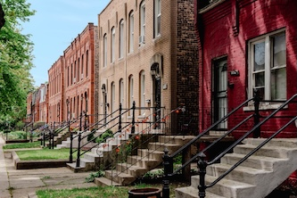
*Row houses in Pullman.* [Photo by Leo Irakliotis]

[Pullman and the Railroad Rebellion](https://www.wttw.com/chicago-stories/pullman-and-the-railroad-rebellion), a PBS documentary.

The rise and fall of Pullman, Illinois, offers a compact case study in industrial paternalism, labor conflict, and the limits of corporate social engineering. Founded in the 1880s by industrialist **George Pullman**, the town was built adjacent to his Pullman Palace Car Company on Chicago’s South Side. Conceived after the Great Railroad Strike of 1877, Pullman’s model community was intended to harmonize capital and labor by providing orderly housing, sanitation, green space, and cultural amenities for workers. Architect Solon S. Beman designed brick row houses, a hotel, library, arcade, and church, all arranged within a carefully regulated environment. Pullman prohibited independent newspapers, town meetings, and saloons; rents were deducted directly from wages. The town embodied a Progressive-era belief that environment could shape moral and economic behavior.

Pullman initially attracted national and international praise as a demonstration of enlightened industrial planning. Yet its structural tensions became apparent during the economic depression of 1893. When railcar orders collapsed, Pullman reduced wages but refused to lower rents or utility charges in the company-owned town. Workers, led by Eugene V. Debs and the American Railway Union, struck in 1894. The **Pullman Strike** escalated into a nationwide rail stoppage, prompting federal intervention and the deployment of troops. The conflict left dozens dead and crystallized debates over labor rights, corporate authority, and the role of the state. A federal commission later criticized Pullman’s paternalism as incompatible with democratic citizenship, and the Illinois Supreme Court ordered the company to divest its residential properties.

The town survived, but its founding premise collapsed. Pullman became absorbed into Chicago in 1889, and over time the industrial base declined. In 2015, the area was designated **Pullman National Historical Park**, preserving its architecture as a monument to industrial modernity and labor struggle.

Today, Pullman is a restored historic district and museum landscape. It represents both a preserved experiment in corporate planning and a reminder that urban order imposed from above cannot substitute for negotiated social equity.

1. Pullman (company town), Wikipedia:
   [https://en.wikipedia.org/wiki/Pullman,_Chicago](https://en.wikipedia.org/wiki/Pullman,_Chicago)

2. Pullman Strike, Encyclopaedia Britannica:
   [https://www.britannica.com/event/Pullman-Strike](https://www.britannica.com/event/Pullman-Strike)

3. National Park Service – Pullman National Historical Park:
   [https://www.nps.gov/pull/index.htm](https://www.nps.gov/pull/index.htm)

---

### Immigrants and the Making of 19th-Century Chicago

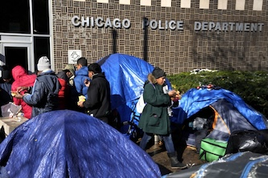
*Migrants outside Chicago's 17th District police station in Albany Park*. [Photo, courtesy of AP/Charles Rex Arbogast, 2024].

Chicago’s transformation in the nineteenth century was fundamentally an immigrant story. From its incorporation as a town of a few hundred in 1833, the city’s explosive growth was underwritten by waves of newcomers who arrived seeking economic opportunity and forged the social and cultural fabric of what became one of the United States’ largest urban centers. By 1900, Chicago had grown to nearly **1.7 million people**, and a substantial proportion of this population boom was fueled by migration from abroad—particularly from Europe—beginning in the 1840s and intensifying after the Civil War. ([turn0search1](https://en.wikipedia.org/wiki/Chicago); [turn0search3](https://en.wikipedia.org/wiki/History_of_Chicago))

The earliest significant inflows were Irish and German immigrants. The Irish came in large numbers during and after the **Great Famine** of the late 1840s, while Germans—who began arriving in the Midwest earlier—established a substantial presence by mid-century. By 1850, more than half of Chicago’s population was foreign-born, a demographic dominance that distinguished the city from many other American locales. Immigrants arrived in part because Chicago’s rapid rise as a transportation and industrial hub—linked to the opening of the Illinois and Michigan Canal in 1848 and the expansion of railroads—created unprecedented demand for labor in construction, shipping, meatpacking, and manufacturing. This economic magnetism anchored the city as a destination for transatlantic migrants throughout the century. ([turn0search1](https://en.wikipedia.org/wiki/Chicago); [turn0search2](https://www.britannica.com/place/Chicago/People))

German immigrants became especially prominent. From 1850 onward, Germans frequently constituted Chicago’s largest ethnic group; by 1900, roughly **one in four Chicago residents** was either born in Germany or had a German parent. These immigrants did not merely populate the city; they created robust institutional structures—churches, newspapers, cultural societies, and social clubs—that shaped urban life and provided social cohesion for subsequent arrivals. These organizations fostered vibrant communal identities that coexisted with, and at times competed with, American civic institutions. ([turn0search10](https://www.encyclopedia.chicagohistory.org/pages/512.html))

As the century progressed, the ethnic composition of Chicago’s immigrant population diversified. Eastern and Southern Europeans arrived in significant numbers in the decades following the Civil War, including Poles, Italians, Jews from Russia, Czechs, and Scandinavians. These groups typically clustered in distinct neighborhoods where linguistic and cultural ties could be maintained, giving rise to ethnic enclaves such as *Polish Downtown*, which became densely settled and socially autonomous by the 1890s. Immigrants from Eastern Europe often worked in unskilled or semi-skilled industrial jobs, filling roles in stockyards, railroads, and factories that sustained Chicago’s economic engine. ([turn0search3](https://en.wikipedia.org/wiki/History_of_Chicago); [turn0search31](https://en.wikipedia.org/wiki/Polish_Downtown_%28Chicago%29))

Beyond European groups, other immigrant communities began to take shape in the late nineteenth century, including Greeks and (later, in the early twentieth century) Mexican migrants. While the 1800s narrative is dominated by Europeans, the roots of Chicago’s later multicultural identity emerge in this period, reflecting the city’s role as a gateway for global mobility and labor migration. ([turn0search36](https://en.wikipedia.org/wiki/Greeks_in_Chicago); [turn0search14](https://www.historians.org/perspectives-article/latino-chicago))

Immigrants reshaped Chicago not merely demographically but institutionally and culturally. Ethnic newspapers, religious institutions, mutual aid societies, and settlement houses like the Northwestern University Settlement House worked to integrate new arrivals while preserving cultural identity, mediating between immigrant communities and broader civic life. Their presence also catalyzed political contention: nativist movements such as the Know-Nothing Party in the 1850s explicitly targeted foreign-born communities, reflecting enduring tensions over immigration, labor competition, and cultural pluralism. ([turn0search3](https://en.wikipedia.org/wiki/History_of_Chicago); [turn0search34](https://en.wikipedia.org/wiki/Northwestern_University_Settlement_House))

In sum, immigrants were central to Chicago’s ascent in the nineteenth century. Far from being a passive backdrop to economic expansion, they were active agents shaping neighborhoods, labor markets, and civic institutions, leaving a legacy that persists in the city’s enduring ethnic diversity and vibrant cultural landscape.

 **Sources & Suggested Reading**

1. *History of Chicago – 19th Century Immigration and Population*, Wikipedia: [https://en.wikipedia.org/wiki/History_of_Chicago#Immigration_and_population_in_19th_century](https://en.wikipedia.org/wiki/History_of_Chicago#Immigration_and_population_in_19th_century) ([Wikipedia][1])
2. *Chicago – Immigrants, Industry, Culture*, Britannica: [https://www.britannica.com/place/Chicago/People](https://www.britannica.com/place/Chicago/People) ([Encyclopedia Britannica][2])
3. *Chicago’s Germans*, Encyclopedia of Chicago: [https://www.encyclopedia.chicagohistory.org/pages/512.html](https://www.encyclopedia.chicagohistory.org/pages/512.html) ([Chicago History Encyclopedia][3])
4. *Polish Downtown (Chicago)*, Wikipedia: [https://en.wikipedia.org/wiki/Polish_Downtown_%28Chicago%29](https://en.wikipedia.org/wiki/Polish_Downtown_%28Chicago%29) ([Wikipedia][4])
5. *Greeks in Chicago*, Wikipedia: [https://en.wikipedia.org/wiki/Greeks_in_Chicago](https://en.wikipedia.org/wiki/Greeks_in_Chicago) ([Wikipedia][5])

[1]: https://en.wikipedia.org/wiki/History_of_Chicago "History of Chicago"
[2]: https://www.britannica.com/place/Chicago/People "Chicago - Immigrants, Industry, Culture"
[3]: https://www.encyclopedia.chicagohistory.org/pages/512.html "Germans"
[4]: https://en.wikipedia.org/wiki/Polish_Downtown_%28Chicago%29 "Polish Downtown (Chicago)"
[5]: https://en.wikipedia.org/wiki/Greeks_in_Chicago "Greeks in Chicago"

---

### The Yards

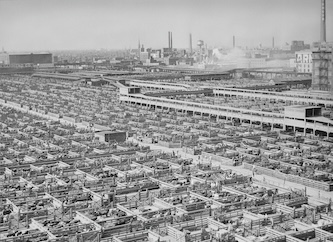

*1947 photo of the Union Stock Yards, from the U.S. National Archives and Records Administration* [Sourced from [Wikimedia](https://en.wikipedia.org/wiki/Union_Stock_Yards#/media/File:The_maze_of_livestock_pens_and_walkways_at_Chicago's_stockyards,_ca._1947_-_NARA_-_541823_(cropped).jpg)]

[Union Stockyards](https://www.wttw.com/chicago-stories/union-stockyards), a WTTW history.

Established in 1865 just southwest of the city center, the **Union Stock Yard and Transit Company** consolidated multiple smaller livestock markets into a centralized facility connected to major rail lines. Chicago’s geographic position—linking Midwestern ranching regions to eastern urban consumers—made it an ideal site for large-scale slaughter and distribution. By the late nineteenth century, the Yards covered hundreds of acres and processed millions of cattle and hogs annually. Firms such as Armour and Swift developed vertically integrated systems combining slaughter, refrigeration, packing, and rail transport, transforming meat from a regional commodity into a national and international product. Chicago became known as the “hog butcher for the world,” and the Yards stood as a symbol of American industrial efficiency.

The industrial logic of the Stock Yards reshaped labor, technology, and urban form. Assembly-line methods pioneered in meatpacking prefigured techniques later adopted in automobile manufacturing. At the same time, working conditions were dangerous and unsanitary, as vividly depicted in Upton Sinclair’s *The Jungle* (1906). Sinclair’s exposé catalyzed federal food safety legislation, including the Meat Inspection Act of 1906, demonstrating how local industrial practices could provoke national regulatory reform. Environmental degradation accompanied production; waste flowed into the Chicago River’s South Fork, producing what became known as “Bubbly Creek.”

The Yards reached peak production in the early twentieth century but began to decline after World War II. Decentralization of meatpacking, the rise of trucking over rail, and relocation of slaughterhouses closer to ranching regions eroded Chicago’s competitive advantage. The Union Stock Yards officially closed in 1971. What had once been the epicenter of global meat distribution became industrial brownfield.

Today, little remains of the original complex beyond the limestone gate preserved as a landmark. The surrounding area has transitioned toward mixed industrial and commercial uses. The Yards’ legacy endures less in physical form than in institutional memory: they represent both the ingenuity and the human and environmental costs of industrial-scale production.

1. Union Stock Yard and Transit Company, Wikipedia:
   [https://en.wikipedia.org/wiki/Union_Stock_Yards](https://en.wikipedia.org/wiki/Union_Stock_Yards)

2. Encyclopaedia Britannica – Chicago: Meatpacking Industry:
   [https://www.britannica.com/place/Chicago/History](https://www.britannica.com/place/Chicago/History)

3. Chicago History Museum – The Union Stock Yards:
   [https://www.chicagohistory.org/the-union-stock-yards/](https://www.chicagohistory.org/the-union-stock-yards/)

---

### Chicago and the World’s Columbian Exposition of 1893: A Coming-of-Age on the Global Stage

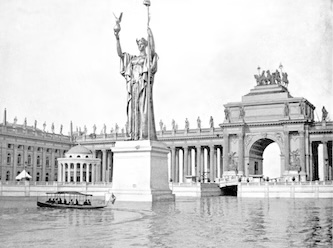

*Visitors tour World’s Columbian Exposition of 1893 in an electric boat, passing the Statue of the Republic. A smaller replica of the statue can be seen today in Jackson Park.* [Photo: Museum of Science and Industry; also part of [The Atlantic's 30 Photos](https://www.theatlantic.com/photo/2024/10/photos-1893-chicago-worlds-fair/680358/) collection from the exposition].

In the late nineteenth century, the city of **Chicago** was still quite young and, by some measures, still wrestling with its identity. Less than a quarter-century had elapsed since the **Great Chicago Fire of 1871**, and yet the city had already grown into a major industrial and transportation hub. It was into this context that Chicago won the right to host the **World’s Columbian Exposition** in **1893**, a world’s fair commemorating the quadricentennial of Christopher Columbus’s landfall in the Americas. Scholars and civic leaders alike saw the exposition as an opportunity—but also a test—to situate Chicago not merely as a successful American city but as a place on the world stage of culture, innovation, and urban modernity. ([Wikipedia][1])

The fair opened on **May 1, 1893**, in **Jackson Park** on Chicago’s South Side and ran through **October 30**, drawing **more than 27 million visitors**—roughly a quarter of the U.S. population at the time—across its six-month run. It featured nearly **200 exhibits** representing **46 nations**, showcasing industrial technologies, artistic achievements, and cultural displays from across the globe. At its core was the famed **Court of Honor**, a monumental group of neoclassical buildings unified in a white staff façade that came to be known as the **“White City.”** ([Wikipedia][1])

Chicago’s success in hosting the Columbian Exposition was no accident. The city had vigorously competed with New York, St. Louis, and Washington, D.C., pledging significant financial and logistical support to secure the fair. Once awarded the exposition, Chicago’s leaders orchestrated an ambitious plan that fused civic boosterism and architectural innovation. The fair’s designers, led by **Daniel H. Burnham** and landscape architect **Frederick Law Olmsted**, envisioned a space that would convey order, beauty, and civic pride—principles that would deeply influence American city planning and the subsequent **City Beautiful movement**. ([Eastern Illinois University][2])

The fair’s scale and spectacle were explicitly meant to position Chicago as a city equal to the great metropoles of Europe. Towers, boulevards, and reflecting pools formed allegories of American industrial power and cultural refinement. Technologies new and emerging—electric lighting, mechanical inventions, and cultural exhibits—signaled both Chicago’s technological ambitions and the broader promise of progress at the dawn of the twentieth century. ([Encyclopedia Britannica][3])

The global dimension of the Columbian Exposition extended beyond architecture and technology to include cultural and social forums such as the **World’s Parliament of Religions** and the **Jewish Women’s Congress**, drawing international visitors and participants in transnational dialogues. ([Wikipedia][4])

The exposition also solidified Chicago’s image in national and international memory. While many buildings were temporary—and almost all were dismantled after the fair—its symbolic impact endured. The later survival of the **Palace of Fine Arts** as the **Museum of Science and Industry** and the lasting presence of Jackson Park as part of the city’s lakefront legacy are physical reminders of the fair’s imprint. Moreover, the exposition’s demonstration of Chicago’s organizational capacity, cultural ambition, and aesthetic vision helped redefine the city as more than a regional industrial center—it was now a **global cultural node** in the emergent modern world. ([Choose Chicago][5])

1. **World’s Columbian Exposition (Wikipedia)** – Overview of the 1893 Chicago World's Fair.
   [https://en.wikipedia.org/wiki/World%27s_Columbian_Exposition](https://en.wikipedia.org/wiki/World%27s_Columbian_Exposition) ([Wikipedia][1])

2. **World’s Columbian Exposition | Britannica** – Historical notes on the fair’s significance and Chicago’s competition to host it.
   [https://www.britannica.com/event/Worlds-Columbian-Exposition](https://www.britannica.com/event/Worlds-Columbian-Exposition) ([Encyclopedia Britannica][3])

3. **Smarthistory: World’s Columbian Exposition Intro** – Contextualization of the fair within global exposition history.
   [https://smarthistory.org/worlds-columbian-exposition-intro/](https://smarthistory.org/worlds-columbian-exposition-intro/) ([Smarthistory][6])

4. **Chicago History Museum: Souvenirs and Stories of the 1893 World’s Columbian Exposition** – Material culture and everyday memories of the fair.
   [https://www.chicagohistory.org/the-souvenirs-and-stories-of-the-1893-worlds-columbian-exposition/](https://www.chicagohistory.org/the-souvenirs-and-stories-of-the-1893-worlds-columbian-exposition/) ([Chicago History Museum][7])

5. **Jewish Women’s Congress at the World’s Columbian Exposition** – Example of global cultural forums held at the fair.
   [https://en.wikipedia.org/wiki/Jewish_Women%27s_Congress](https://en.wikipedia.org/wiki/Jewish_Women%27s_Congress) ([Wikipedia][4])

[1]: https://en.wikipedia.org/wiki/World%27s_Columbian_Exposition "World's Columbian Exposition"
[2]: https://www.eiu.edu/historia/2010Wolski.pdf "The World's Columbian Exposition's Lasting Effect on ..."
[3]: https://www.britannica.com/event/Worlds-Columbian-Exposition "World's Columbian Exposition | History, Facts, & Significance"
[4]: https://en.wikipedia.org/wiki/Jewish_Women%27s_Congress "Jewish Women's Congress"
[5]: https://www.choosechicago.com/articles/itineraries/explore-the-devil-in-the-white-city/ "Explore Devil in the White City | Chicago World's Fair"
[6]: https://smarthistory.org/worlds-columbian-exposition-intro/ "The World's Columbian Exposition: Introduction"
[7]: https://www.chicagohistory.org/the-souvenirs-and-stories-of-the-1893-worlds-columbian-exposition/ "The Souvenirs and Stories of the 1893 World's Columbian ..."

---

### The Great Migration and Chicago: An Urban Transformation

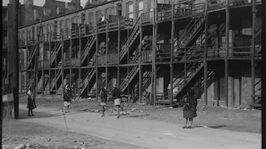
*Apartment building in African-American section of Chicago* [Photo by R. Lee, source  Library of Congress].

The **Great Migration** (1916–1970) was one of the most consequential demographic transformations in United States history, during which approximately six million African Americans relocated from the rural South to urban centers in the North and West. While the migration was driven in part by the push factors of Jim Crow oppression, racial violence, and agricultural stagnation, it was equally shaped by the pull of rapidly expanding industrial economies. Few cities embodied that economic magnetism more fully than Chicago.

In the early twentieth century, Chicago stood at the forefront of technological and industrial innovation. The city’s rise as a national transportation hub—anchored by its vast railroad networks and later supported by mechanized freight systems—positioned it as a central node in the American industrial economy. Advances in mass production techniques, refrigeration technology in meatpacking, mechanized steel manufacturing, and industrial-scale logistics fueled unprecedented economic growth. During World War I, when European immigration slowed dramatically, Chicago’s technologically advanced factories and stockyards faced acute labor shortages. These conditions created concrete employment opportunities that made the city an appealing destination for Southern Black workers seeking stable wages in modern industrial sectors.

Between 1910 and 1930, Chicago’s African American population increased from roughly 44,000 to 230,000. This demographic expansion reflected not only escape from southern racial terror but also the gravitational pull of a city whose economic dynamism was visibly tied to technological progress. The mechanized meatpacking plants of the Union Stock Yards, the vertically integrated steel mills in nearby Gary and South Chicago, and the rail and manufacturing complexes all represented entry points into the industrial modernity that defined early twentieth-century growth.

The role of the *Chicago Defender* further amplified this appeal. The newspaper framed Chicago not simply as a refuge, but as a city of industrial promise—a place where technological advancement translated into wages, mobility, and participation in a modern urban economy. By circulating job listings, letters from successful migrants, and accounts of industrial demand, the Defender connected southern readers directly to the expanding technological infrastructure of northern industry.

At the same time, Chicago’s rapid economic growth intensified spatial and racial tensions. Restrictive housing practices confined Black migrants largely to the South Side’s “Black Belt,” even as the city itself expanded outward through streetcar lines, elevated rail, and new industrial corridors. Competition for jobs and housing—exacerbated by the speed of urban growth—contributed to the Chicago Race Riot of 1919. Economic modernization, in other words, did not eliminate racial conflict; it reshaped it within a dense industrial metropolis.

Yet the same economic forces that generated tension also laid the groundwork for enduring community formation. Concentrated settlement in Bronzeville fostered a self-sustaining Black urban economy, cultural institutions, newspapers, businesses, and political organizations. Chicago’s technological and industrial expansion thus functioned as both catalyst and context: it drew migrants northward and provided the material foundation upon which a vibrant Black urban culture emerged.

Chicago’s appeal during the Great Migration cannot be understood solely as an escape from the South. It must also be seen as attraction to a city experiencing extraordinary technological and economic transformation—one that promised participation in the engines of modern American growth.

1. **Allan H. Spear, *Black Chicago: The Making of a Negro Ghetto, 1890–1920*** – Foundational urban history detailing early Black migration and structural segregation in Chicago. *Often cited in race riot studies.*
   *Suggested online reference:* [https://en.wikipedia.org/wiki/Chicago_Race_Riot_of_1919](https://en.wikipedia.org/wiki/Chicago_Race_Riot_of_1919) ([Wikipedia][4])

2. **Claire Hartfield, *A Few Red Drops: The Chicago Race Riot of 1919*** – Narrative account connecting migration pressures and racial conflict in Chicago’s post–World War I context. *Cited in academic sources.* ([Wikipedia][4])

3. **Isabel Wilkerson, *The Warmth of Other Suns*** – Broad sweep of the Great Migration with rich Chicago-centered stories and analysis. *Useful for linking national process to city experience.* ([Smithsonian Magazine][5])

4. **Chicago Defender archives and history** – The Defender’s migration campaign is central to understanding *how* and *why* Chicago became a migrant magnet: [https://en.wikipedia.org/wiki/The_Chicago_Defender](https://en.wikipedia.org/wiki/The_Chicago_Defender) ([Wikipedia][3])

5. **Chicago Black Renaissance (Wikipedia)** – Analysis of cultural flowering rooted in migration’s demographic impact: [https://en.wikipedia.org/wiki/Chicago_Black_Renaissance](https://en.wikipedia.org/wiki/Chicago_Black_Renaissance) ([Wikipedia][2])

[1]: https://www.britannica.com/event/Great-Migration "Great Migration | Definition, History, Map, & Years"
[2]: https://en.wikipedia.org/wiki/Chicago_Black_Renaissance "Chicago Black Renaissance"
[3]: https://en.wikipedia.org/wiki/The_Chicago_Defender "The Chicago Defender"
[4]: https://en.wikipedia.org/wiki/Chicago_race_riot_of_1919 "Chicago race riot of 1919"
[5]: https://www.smithsonianmag.com/history/long-lasting-legacy-great-migration-180960118/ "The Long-Lasting Legacy of the Great Migration"

---

### CHA

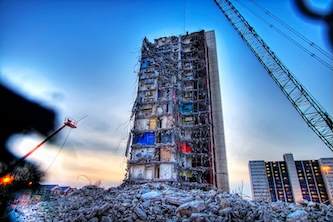
*The last phase of Cabrini-Green's demolition in 2011.* [Photo, courtesy of [InTheseTimes](https://inthesetimes.com/article/70-acres-cabrini-green-documentary-chicago-housing-authority).]

The history of the Chicago Housing Authority (CHA) offers a revealing lens through which to examine twentieth-century urban policy, segregation, and concentrated poverty in the United States. Established in 1937 under the federal Housing Act, the CHA was initially conceived as a reformist intervention: to replace substandard tenements with safe, affordable housing for working-class families. Early developments, such as the Jane Addams Homes, reflected Progressive aspirations toward sanitary design and social uplift. Yet over time, the authority’s policies and siting decisions became deeply entangled with racial politics and spatial segregation.

Following the Great Migration, Chicago’s Black population expanded rapidly, while restrictive covenants and discriminatory lending practices limited residential mobility. Rather than dispersing public housing throughout the city, CHA developments increasingly concentrated units in predominantly Black neighborhoods on the South and West Sides. By the 1950s and 1960s, large high-rise complexes such as the Robert Taylor Homes and Cabrini-Green embodied a shift toward vertical density and cost efficiency. These projects were justified as rational planning responses to housing shortages, yet their scale and location reinforced racial and economic isolation. As historian Arnold Hirsch has argued, mid-century public housing policy effectively constructed a “second ghetto,” institutionalizing segregation through administrative decision-making rather than explicit statute.

The socioeconomic consequences were profound. Deindustrialization in the 1960s and 1970s eroded employment opportunities in proximity to the projects. As manufacturing jobs disappeared, residents faced structural unemployment, underfunded schools, and limited transit connectivity. Crime rates rose in several large developments, particularly during the crack cocaine epidemic of the 1980s and 1990s. It is important, however, to avoid simplistic causal claims: crime did not emerge from public housing per se, but from the intersection of concentrated poverty, limited economic mobility, and weakened municipal investment. The design of high-rise superblocks—isolated from street grids and commercial corridors—often compounded surveillance challenges and reduced informal social control.

By the late twentieth century, the CHA’s high-rise model was widely viewed as untenable. In 2000, the authority launched its “Plan for Transformation,” a sweeping effort to demolish large projects and replace them with mixed-income, lower-density developments. The policy sought to deconcentrate poverty and reintegrate former residents into broader neighborhood contexts. While the plan reduced the number of high-rise units and altered the skyline of the South and West Sides, its long-term socioeconomic effects remain debated. Critics note displacement and loss of deeply rooted community networks; proponents argue that mixed-income models have improved safety and housing quality.

The trajectory of the Chicago Housing Authority illustrates the limits of technocratic planning detached from labor markets and regional equity. Public housing was conceived as a mechanism of social stability, yet in practice it became a spatial instrument of segregation. The rise and fall of the projects underscore a recurring theme in Chicago’s history: large-scale planning can reorganize urban space, but without parallel economic inclusion, structural inequality persists. The CHA’s evolution thus reflects both the ambition and the unintended consequences of twentieth-century urban governance.

1. Chicago Housing Authority – History
   [https://www.thecha.org/about/history](https://www.thecha.org/about/history)

2. Encyclopedia of Chicago – Public Housing
   [http://www.encyclopedia.chicagohistory.org/pages/1013.html](http://www.encyclopedia.chicagohistory.org/pages/1013.html)

3. Chicago Tribune – Plan for Transformation overview
   [https://www.chicagotribune.com/news/ct-xpm-2000-02-07-0002070191-story.html](https://www.chicagotribune.com/news/ct-xpm-2000-02-07-0002070191-story.html)

---

### Chicago’s Transportation History: From Portage to Global Hub

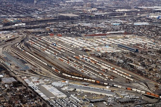
*Corwith rail yard in Chicago's Brighton Park. At the time of its construction, it was the largest in the world.* [Photo: courtesy of formulanone, [Wikimedia](https://en.wikipedia.org/wiki/Corwith_Yard#/media/File:Corwith_Intermodal_Facility.jpg)]

Chicago’s ascendancy as a **transportation hub** was neither accidental nor incidental; it stemmed from a conjunction of geography, technology, and economic opportunity that positioned the city at the crossroads of North America’s inland trade networks. Long before railroads or skyscrapers, the region’s physical landscape held the seeds of its future centrality. At the junction where the **Great Lakes** and the **Mississippi River** watershed nearly met, the historic **Chicago Portage** provided an easy passage for Native American trade routes and, later, European explorers. This natural link between the Atlantic and the interior facilitated early economic activity and foreshadowed Chicago’s emergence as a nexus of continental commerce.([Wikipedia][1])

The transformative moment in Chicago’s transportation history arrived in **1848** with the completion of the **Illinois and Michigan Canal**. By connecting the Chicago River to the Illinois River—and thence to the Mississippi—the canal made Chicago the key conduit between the **Great Lakes** and the nation’s interior waterways. Before the advent of railroads, this waterborne link enabled schooners and freight steamers to move lumber, grain, and other commodities between the agricultural Midwest and eastern markets, amplifying the city’s importance as a logistical hub.([Chicago Maritime Museum][2])

Even as waterborne commerce catalyzed early growth, it was the rapid expansion of the **railroad network** that cemented Chicago’s centrality in national transportation. Chicago became the quintessential **rail hub** of the United States in the second half of the nineteenth century, as multiple rail lines converged in the city, linking agricultural producers in the Midwest with markets in the East and West. The first railroad, the **Galena & Chicago Union**, was chartered in 1836 and laid tracks that would form Chicago’s earliest rail infrastructure. Over succeeding decades, competing lines radiated outward, connecting Chicago with Detroit, St. Louis, Minneapolis-St. Paul, and beyond. By the time the First Transcontinental Railroad was completed in **1869**, Chicago had solidified its status as the nation’s dominant railroad junction, shaping not only freight distribution but urban growth and industrial development.([Chicago History Encyclopedia][3])

Railroads amplified Chicago’s logistical advantages, feeding a booming industrial economy anchored in meatpacking, grain trade, and manufacturing. Situated at the heart of North America’s agricultural hinterland and equipped with deepwater access to the Great Lakes, Chicago became both a collection point for raw materials and a distribution center for finished goods. This pivotal role in freight movement persists into the present: today the **Chicago metropolitan area** handles roughly a quarter of all U.S. freight trains and half of the nation’s intermodal rail traffic, maintaining its preeminence in continental freight logistics.([Chicago Metropolitan Agency for Planning][4])

Complementing water and rail, Chicago developed an intricate **urban transportation system** to support its dense and growing population. The **Chicago “L”**, one of the oldest elevated rapid transit systems in the United States, began operations in **1892** and helped structure the city’s development around a spoke-and-hub model focused on the downtown Loop. Its extensive network, now integrated with buses, commuter rail (Metra), and airports, underscores the city’s multimodal transportation ecosystem.([Wikimedia Commons][5])

By the twentieth century, Chicago’s transportation infrastructure had become global in reach. **O’Hare International** and **Midway International** linked the city to international markets, tourism flows, and air freight networks, extending its status as a global city. The integration of water, rail, road, and air transport in Chicago illustrates how infrastructure and geography converged to propel a once-frontier outpost into one of the world’s great transportation capitals.

1. **Wikipedia – Transportation in Chicago** – Comprehensive overview of modes, systems, and infrastructure:
   [https://en.wikipedia.org/wiki/Transportation_in_Chicago](https://en.wikipedia.org/wiki/Transportation_in_Chicago) ([Wikipedia][6])

2. **Chicago Portage (Wikipedia)** – On the pre-canal geographic foundation of Chicago’s hub status:
   [https://en.wikipedia.org/wiki/Chicago_Portage](https://en.wikipedia.org/wiki/Chicago_Portage) ([Wikipedia][1])

3. **Illinois & Michigan Canal History** – Details on the canal’s construction and impact on Chicago’s rise:
   [https://iandmcanal.org/canalhistory/](https://iandmcanal.org/canalhistory/) ([I & M Canal][7])

4. **How The Railroads Helped Shape Chicago** (Classic Chicago Magazine) – Railroads’ role in urban and economic growth:
   [https://classicchicagomagazine.com/how-the-railroads-helped-shape-chicago/](https://classicchicagomagazine.com/how-the-railroads-helped-shape-chicago/) ([Annie Rules -][8])

5. **Metropolitan Chicago Freight Hub Overview** – Chicago’s continuing role in national logistics:
   [https://cmap.illinois.gov/regional-plan/goals/recommendation/maintain-the-regions-status-as-north-americas-freight-hub/](https://cmap.illinois.gov/regional-plan/goals/recommendation/maintain-the-regions-status-as-north-americas-freight-hub/) ([Chicago Metropolitan Agency for Planning][4])

[1]: https://en.wikipedia.org/wiki/Chicago_Portage "Chicago Portage"
[2]: https://www.chicagomaritimemuseum.org/maritime-history/chicagos-modern-port "Chicago's Modern Port"
[3]: https://www.encyclopedia.chicagohistory.org/pages/1039.html "Railroads"
[4]: https://cmap.illinois.gov/regional-plan/goals/recommendation/maintain-the-regions-status-as-north-americas-freight-hub/ "Maintain the region's status as North America's freight hub"
[5]: https://commons.wikimedia.org/wiki/File%3AChicago_%22L%22_Line%2C_Chicago%2C_Illinois_%289179335989%29.jpg "File:Chicago \"L\" Line, Chicago, Illinois (9179335989).jpg"
[6]: https://en.wikipedia.org/wiki/Transportation_in_Chicago "Transportation in Chicago - Wikipedia"
[7]: https://iandmcanal.org/canalhistory/ "Canal History – I & M Canal"
[8]: https://classicchicagomagazine.com/how-the-railroads-helped-shape-chicago/ "How The Railroads Helped Shape Chicago"

---

### Printing in Chicago

The history of the printing industry in Chicago reflects the city’s broader trajectory as a commercial, logistical, and cultural hub of the American interior. From the mid-nineteenth century onward, Chicago emerged as one of the nation’s leading centers of printing, publishing, and book distribution, supported by rail connectivity, a rapidly growing population, and expanding newspaper circulation.

Early printers followed the city’s commercial growth. By the 1850s, Chicago had become a major wholesale market for the Midwest, and printers supplied everything from newspapers and catalogs to legal forms and advertising materials. After the Great Fire of 1871 destroyed many presses, the industry rebuilt quickly, aided by improved fireproof construction and advances in typesetting and mechanical printing. The concentration of publishing houses and printing firms along Dearborn Street south of Congress Parkway led to the area’s later designation as Printer's Row. Multi-story loft buildings, such as the Donohue and Dearborn Station Printing House structures, were designed to accommodate heavy presses and large workforces, often incorporating reinforced floors and freight elevators.

By the late nineteenth and early twentieth centuries, Chicago was second only to New York in printing output. The city became a national center for mail-order catalogs—most famously those of Sears, Roebuck and Montgomery Ward—which relied on large-scale printing and distribution networks. Advances such as the Linotype machine accelerated typesetting, while Chicago’s newspapers, including the Chicago Tribune and Chicago Daily News, fueled demand for high-volume production. Printing was both an industrial and cultural enterprise: it enabled political communication, advertising, literary publication, and civic identity formation.

The mid-twentieth century saw gradual decentralization as printing operations relocated to suburban industrial parks, and digital technologies later reduced demand for large press facilities. Printer’s Row transitioned into a residential and cultural district, yet its architecture preserves the material footprint of Chicago’s publishing era. The industry’s legacy persists not only in buildings but in the city’s enduring identity as a center of communication, reform journalism, and commercial distribution.

1. Encyclopedia of Chicago – Printing and Publishing
   [http://www.encyclopedia.chicagohistory.org/pages/2481.html](http://www.encyclopedia.chicagohistory.org/pages/2481.html)

2. Encyclopedia of Chicago – Printer’s Row
   [http://www.encyclopedia.chicagohistory.org/pages/1010.html](http://www.encyclopedia.chicagohistory.org/pages/1010.html)

3. Chicagology – Chicago’s Golden Age of Printing
   [https://chicagology.com/goldenage/goldenage216/](https://chicagology.com/goldenage/goldenage216/)

4. Chicago Sun-Times – Printer’s Row Neighborhood Guide
   [https://chicago.suntimes.com/2018/6/27/18338966/printers-row-neighborhood-guide-chicago-restaurants-bars-shops](https://chicago.suntimes.com/2018/6/27/18338966/printers-row-neighborhood-guide-chicago-restaurants-bars-shops)

---

### The Eastland Disaster: Chicago’s Forgotten Maritime Catastrophe

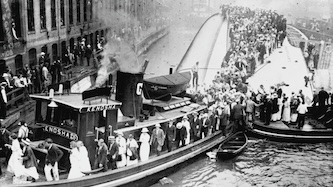

*Tugboat Kenosha helps evacuate survivors after the S.S. Eastland rolled and partially sunk on July 24, 1915.* [Photo: Chicago Tribune Archives]

On **July 24, 1915**, the passenger steamship **SS *Eastland*** capsized on the **Chicago River** in one of the deadliest maritime disasters in American history. While overshadowed in public memory by the **Titanic** and other global tragedies, the **Eastland disaster** claimed at least **844 lives**, exceeding the fatalities of the Great Chicago Fire or the Iroquois Theatre Fire and and becoming the worst single-ship loss of life on the Great Lakes.([Encyclopedia Britannica][1])

**Context and Voyage.** Built in 1902 and based in Chicago, the *Eastland* was a popular excursion steamer used for day trips and lake cruises. By 1915, the vessel had developed a reputation for instability, nearly capsizing on several prior occasions. A new federal maritime safety law passed earlier that year—partly in response to the Titanic disaster—required passenger ships to carry a full complement of lifeboats and related gear. While well-intended, these additions increased the ship’s already high center of gravity, exacerbating its tendency to list.([Encyclopedia Britannica][1])

On that fateful July morning, the *Eastland* and four other steamers were chartered by the **Western Electric Company** to transport employees, families, and friends from the company’s **Hawthorne Works** in Cicero, Illinois, to a picnic in Michigan City, Indiana. Some 2,500 passengers were packed aboard as boarding commenced on the south bank of the Chicago River near the **Clark Street Bridge**.([Historical Society of Forest Park][2])

**Capsizing and Immediate Aftermath.** Shortly after 7:25 a.m.—before the ship even cleared the dock—the *Eastland* began to list sharply to port. Attempts by the crew to correct the tilt using ballast tanks only intensified its instability. Around **7:28 a.m.**, the vessel rolled completely onto its port side and came to rest in roughly **20 feet of water**, still tied to the wharf. Because the disaster occurred so close to shore, onlookers and workers nearby witnessed the roll firsthand. Warehouse laborers and crew from other vessels rushed to aid the trapped passengers.([Encyclopedia Britannica][1])

Despite these rescue efforts, hundreds who had gone below deck to escape the cool and damp morning were trapped once the hull rolled, drowning or being crushed by heavy furniture and equipment. Bodies were taken to temporary morgues around Chicago—including the **Second Regiment Armory**—as families searched for loved ones.([WTTW Chicago][3])

**Victims and Community Impact.** The passenger manifest reflected Chicago’s diverse working-class population: immigrants from Central and Northern Europe, many of whom were factory laborers or families connected to the Hawthorne Works, perished in large numbers. Contemporary estimates suggest that entire families were lost in the tragedy, and a disproportionately high number of women, children, and young adults were among the dead.([chicagobikeadventures.com][4])

In the days and weeks that followed, the city grappled with the scale of loss. Relief funds provided by Western Electric and other civic organizations helped with funerary costs, but legal battles over liability dragged on for decades with limited compensation for survivors and families.([National Archives][5])

**Legacy.** Despite its magnitude, the Eastland disaster remained relatively under-remembered in national histories. Recent efforts by historians and organizations like the **Eastland Disaster Historical Society** have worked to preserve the stories, artifacts, and personal accounts of those lost and those who survived.([archives.newberry.org][6])

1. **Britannica Editors, *Eastland disaster*** – An authoritative overview with timeline and analysis: [https://www.britannica.com/event/Eastland-disaster](https://www.britannica.com/event/Eastland-disaster) ([Encyclopedia Britannica][1])
2. **National Archives at Chicago – Steamship Eastland Disaster** – Digitized case files and legal records: [https://www.archives.gov/chicago/highlights/eastland](https://www.archives.gov/chicago/highlights/eastland) ([National Archives][5])
3. **Eastland Disaster Historical Society** – Primary sources, records, and memorial context: [https://archives.newberry.org/repositories/2/resources/1236](https://archives.newberry.org/repositories/2/resources/1236) ([archives.newberry.org][6])
4. **Smithsonian Magazine, *Eastland Disaster* article** – Contextual essay comparing Eastland to other maritime tragedies: [https://www.smithsonianmag.com/history/eastland-disaster-killed-more-passengers-titanic-and-lusitania-why-has-it-been-forgotten-180953146/](https://www.smithsonianmag.com/history/eastland-disaster-killed-more-passengers-titanic-and-lusitania-why-has-it-been-forgotten-180953146/) ([smithsonianmag.com][7])

[1]: https://www.britannica.com/event/Eastland-disaster "Eastland disaster | Chicago, Background, Causes, Deaths ..."
[2]: https://www.forestparkhistory.org/eastland-ship-disaster.html "Eastland Ship Disaster"
[3]: https://www.wttw.com/timemachine/eastland-disaster "EASTLAND DISASTER | WTTW Chicago"
[4]: https://chicagobikeadventures.com/eastland-disaster-victims-map/ "Eastland Disaster Victims Map"
[5]: https://www.archives.gov/chicago/highlights/eastland "Steamship Eastland Disaster"
[6]: https://archives.newberry.org/repositories/2/resources/1236 "Collection: Eastland Disaster Historical Society records"
[7]: https://www.smithsonianmag.com/history/eastland-disaster-killed-more-passengers-titanic-and-lusitania-why-has-it-been-forgotten-180953146/ "The Eastland Disaster Killed More Passengers Than ..."

---

### The Skyline

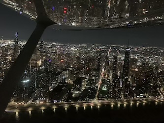
*Chicago's skyline at night, from the air.* [Photo by Leo Irakliotis].

Chicago’s identity as a vertical city rests on a sequence of engineering and architectural breakthroughs that transformed both its skyline and the global practice of tall-building design. From the late nineteenth century onward, the city functioned as a laboratory for structural experimentation, driven by post-Fire rebuilding, dense commercial demand, and a culture of technical innovation.

The late nineteenth century marked a decisive transition from masonry to skeletal construction. The Monadnock Building (1891–93) stands at this threshold. Its north half represents the last generation of massive load-bearing masonry walls—six feet thick at the base—while its south half incorporates steel-frame construction. This hybrid condition captures Chicago at a structural turning point: moving from compressive brick mass toward tensile steel skeletons capable of unprecedented height and window area. The so-called “Chicago School” of architecture embraced this skeletal logic, enabling taller, lighter, and more commercially viable office buildings.

By the mid-twentieth century, advances in structural engineering allowed Chicago to move beyond incremental height increases toward systemic innovation. The career of Fazlur Rahman Khan at Skidmore, Owings & Merrill (SOM) was pivotal. Khan reconceptualized tall buildings not as vertical stacks of beams and columns but as integrated structural systems. His “tube” designs—where closely spaced perimeter columns act together as a rigid hollow tube—dramatically improved resistance to lateral wind forces while reducing material usage. The bundled tube system reached its most famous expression in the Willis Tower (completed 1973 as Sears Tower). Composed of nine interconnected tubes of varying heights, the building achieved 110 stories while maintaining structural efficiency. Khan’s innovations reshaped global skyscraper design, influencing towers across Asia and the Middle East.

Chicago’s skyline also reflects the interplay between engineering pragmatism and architectural symbolism. The 875 North Michigan Avenue (formerly John Hancock Center, 1969) employs an X-braced exterior truss system that expresses structural forces visibly on the façade. The diagonal bracing reduces interior columns and stiffens the tower against wind loads, while simultaneously creating a distinctive visual identity. Here, structure becomes architecture: the engineering solution defines aesthetic character.

More recent developments continue this tradition of structural and environmental experimentation. Aqua (2009), designed by Jeanne Gang, integrates undulating balconies that modulate wind loads, reduce solar gain, and create outdoor space at height. The tower demonstrates how contemporary Chicago architecture extends beyond structural height toward environmental performance and mixed-use density.

Underlying these achievements are broader construction innovations. The post-1871 adoption of fireproof materials, the refinement of elevator technology, caisson foundations capable of anchoring towers in Chicago’s soft soil, and wind-tunnel testing all contributed to making extreme verticality feasible. Chicago’s engineers also pioneered computational modeling in structural analysis during the twentieth century, reinforcing the city’s position as a technical epicenter.

In sum, Chicago’s skyscrapers are not merely tall buildings; they represent iterative advances in structural systems, materials science, and architectural expression. From masonry mass to bundled tubes and environmentally responsive façades, the city’s skyline narrates a sustained dialogue between engineering logic and civic ambition.

1. Council on Tall Buildings and Urban Habitat (CTBUH) – Structural Innovations by Fazlur Khan
   [https://www.ctbuh.org/papers](https://www.ctbuh.org/papers)

2. Chicago Architecture Center – Chicago School and Skyscraper History
   [https://www.architecture.org/learn/resources/architecture-dictionary/entry/chicago-school/](https://www.architecture.org/learn/resources/architecture-dictionary/entry/chicago-school/)

3. Encyclopaedia Britannica – Skyscraper Development
   [https://www.britannica.com/technology/skyscraper](https://www.britannica.com/technology/skyscraper)

4. SOM (Skidmore, Owings & Merrill) – Engineering the Willis Tower
   [https://www.som.com/projects/willis-tower/](https://www.som.com/projects/willis-tower/)

---

### Sears Tower

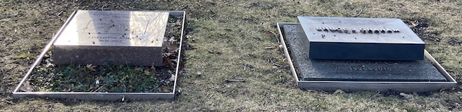

*Friends and creative partners Fazlur Khan (1929–1982) and Bruce Graham (1925–2010) next to each other at the Graceland Cemetery. Together, they designed and built two of Chicago's most iconic towers: Sears and Hancock.*  [Photo by Nick Number, [Wikimedia](https://en.wikipedia.org/wiki/Fazlur_Rahman_Khan#/media/File:Graves_of_Fazlur_Rahman_Khan_(1929%E2%80%931982)_and_Bruce_John_Graham_(1925%E2%80%932010)_at_Graceland_Cemetery,_Chicago.jpg), cropped for sizing]

The construction of the Willis Tower — originally known as the Sears Tower — stands as one of the defining engineering achievements of twentieth-century skyscraper design. Built between 1970 and 1974 in downtown Chicago, the tower reached an architectural height of approximately **1,451 feet (442 m)** with 108–110 stories, making it the world’s tallest building at the time of its completion and holding that title from 1973 until 1998. ([Wikipedia][1])

The tower was commissioned by Sears, Roebuck & Company as a consolidated corporate headquarters and developed by the Chicago office of **Skidmore, Owings & Merrill (SOM)**, with architect **Bruce Graham** and structural engineer **Fazlur Rahman Khan** leading the design. ([Wikipedia][1]) Khan’s structural innovation was the **“bundled tube” system** — an arrangement of nine square-tube steel frames closely grouped in a 3×3 matrix. Each tube measures roughly 75 feet per side, and together they form a stiff, integrated unit that resists both gravity and lateral wind loads efficiently. ([SOM][2]) Compared with earlier skyscraper techniques, this system offered a dramatic improvement in material economy and structural capacity, allowing the tower to rise with less steel per square foot than previous tall buildings and enabling open interior floor plans. ([AISC][3])

Foundations for the structure were built on **reinforced concrete caissons** extending to bedrock, providing a stable base for the immense vertical loads. ([SOM][2]) The exterior cladding combined black anodized aluminum and tinted glass, characteristic of International Style modernism and reflecting a broad mid-century architectural aesthetic. ([Wikipedia][1]) During construction, innovative logistics were used to maintain efficiency on the fast-paced schedule: crews hoisted material directly to floors via strategically placed cranes, and even moveable lunch carts were operated so workers did not descend from elevated levels for breaks. ([AISC][4])

Upon completion, the Willis/Tower not only set global height records but also influenced skyscraper design worldwide. The bundled-tube concept pioneered here became a foundational strategy for high-rise construction in subsequent decades, underpinning many of the world’s tallest buildings and marking a shift toward structural logic that integrates form, economy, and performance. ([Encyclopedia Britannica][5])

* Council on Tall Buildings and Urban Habitat – Willis Tower profile
  [https://www.skyscrapercenter.com/building/willis-tower/169](https://www.skyscrapercenter.com/building/willis-tower/169)

* AISC Modern Steel Construction – “A Pioneer in Bundled-Tube Design”
  [https://www.aisc.org/modern-steel/news/a-pioneer-in-bundled-tube-design-iconic-willis-tower-turns-50/](https://www.aisc.org/modern-steel/news/a-pioneer-in-bundled-tube-design-iconic-willis-tower-turns-50/)

* PBS *Building Big* – Sears Tower structural overview
  [https://www.pbs.org/wgbh/buildingbig/wonder/structure/sears_tower.html](https://www.pbs.org/wgbh/buildingbig/wonder/structure/sears_tower.html)

[1]: https://en.wikipedia.org/wiki/Willis_Tower "Willis Tower"
[2]: https://www.som.com/projects/willis-tower-formerly-sears-tower/ "Willis Tower"
[3]: https://www.aisc.org/modernsteel/news/2023/may/a-pioneer-in-bundled-tube-design-iconic-willis-tower-turns-50/ "A Pioneer in Bundled-Tube Design, Iconic Willis Tower ..."
[4]: https://www.aisc.org/modern-steel/news/a-pioneer-in-bundled-tube-design-iconic-willis-tower-turns-50/ "A Pioneer in Bundled-Tube Design, Iconic Willis Tower ..."
[5]: https://www.britannica.com/technology/bundled-tube-system "Bundled tube system | architecture"

---

### The Trib

*Pressman Ray Cueto checks quality at the Chicago Tribune Freedom Center printing facility in 2007. The Tribune's printing presses were so massive that they had to be mounted, with steel pillings, to the bedrock under the river, to prevent them from rocking and destabilizing the entire printing facility at Goose Island.* [Photo, courtesy of the Chicago Tribune.]

The history of the Chicago Tribune offers a window into the broader trajectory of the press in Chicago: from partisan nineteenth-century boosterism, to the architectural self-confidence of the early twentieth century, to the national political influence of metropolitan newspapers during their “golden age,” and finally to the structural challenges confronting print journalism today.

Founded in 1847, the *Tribune* quickly became aligned with Republican politics and Midwestern commercial interests. Under publisher Joseph Medill, the paper advocated vigorously for Abraham Lincoln and helped consolidate Chicago’s identity as a rising industrial and political center. By the late nineteenth century, Chicago supported multiple major dailies—the *Tribune*, the *Daily News*, the *Times-Herald*, and later the *Sun-Times*—reflecting both the city’s population growth and its appetite for political and investigative reporting. Newspapers were not simply observers of urban life; they were civic actors shaping reform campaigns, labor debates, and municipal governance.

The most visible architectural expression of this institutional confidence is the Tribune Tower, completed in 1925 after an international design competition. The resulting neo-Gothic structure by Raymond Hood and John Mead Howells was deliberately monumental. Flying buttresses, pointed arches, and a crown inspired by European cathedrals signaled cultural authority and historical continuity. Embedded in its façade are stones gathered from global landmarks—Westminster Abbey, the Great Wall of China, the Parthenon—transforming the building into a literal archive of Western civilization. In architectural terms, the tower asserted that journalism was not merely commercial enterprise but civic institution.

The interwar and postwar decades marked the high point of newspaper power. The *Tribune* became nationally influential under Colonel Robert R. McCormick, whose conservative editorial stance shaped debates over isolationism, federal policy, and anti-communism. The paper’s reach extended beyond Illinois through syndication and wire services. During this period, metropolitan newspapers functioned as agenda-setters in American politics. They mediated public discourse, endorsed candidates, and framed national narratives. In Chicago specifically, the press also engaged directly with municipal politics, exposing corruption while participating in partisan battles. The relationship between press and power was reciprocal and often contentious.

Yet the authority symbolized by Tribune Tower proved difficult to sustain into the late twentieth and early twenty-first centuries. Like many American newspapers, the *Tribune* faced declining print circulation, advertising revenue loss, and corporate consolidation. The Tribune Company underwent bankruptcy restructuring in 2008 and later became part of larger media conglomerates. Newsroom downsizing and the shift to digital platforms altered both scale and tone of coverage. While investigative reporting persists, the economic model that once supported large metropolitan bureaus has eroded. In 2018, the *Tribune* sold Tribune Tower, a symbolic moment underscoring the transformation of journalism from print-centered civic monument to digitally distributed enterprise.

Chicago’s press history thus mirrors broader structural shifts. In its ascent, the *Tribune* embodied the confidence of industrial modernity—politically assertive, architecturally grand, institutionally dominant. In its present form, it reflects the decentralization and fragmentation of contemporary media. The Gothic tower remains, but the economic and cultural foundations that produced it have been reconfigured. The story of the *Tribune* is therefore not only about a newspaper; it is about the changing infrastructure of democratic communication.

1. Chicago Tribune – About the Tribune
   [https://www.chicagotribune.com/about/](https://www.chicagotribune.com/about/)

2. Chicago Architecture Center – Tribune Tower
   [https://www.architecture.org/learn/resources/buildings-of-chicago/building/tribune-tower/](https://www.architecture.org/learn/resources/buildings-of-chicago/building/tribune-tower/)

3. Columbia Journalism Review – Coverage of Tribune Company restructuring
   [https://www.cjr.org/](https://www.cjr.org/)

4. Encyclopaedia Britannica – Chicago Tribune
   [https://www.britannica.com/topic/Chicago-Tribune](https://www.britannica.com/topic/Chicago-Tribune)

---

### Before Amazon Prime, there was Chicago

*A Sears house in Geneva, Ill.*

Chicago’s rise as a national economic hub in the late nineteenth and early twentieth centuries was closely tied to the emergence and expansion of the *mail-order* and *retail catalog* industry. Two Chicago firms — **Montgomery Ward & Co.** and **Sears, Roebuck and Co.** — helped invent a mass-marketing and distribution model that reshaped American consumer culture, extended Chicago’s economic reach, and presaged many features of modern e-commerce. ([Chicago History Encyclopedia][1])

Aaron Montgomery Ward, a Chicago salesman, launched what is widely recognized as the first successful general *mail-order* catalog in 1872 to serve rural customers excluded from the diverse inventories of urban stores. His early catalogs began modestly — a single sheet listing 163 items — but rapidly expanded into multi-hundred-page books that offered a vast array of products directly to consumers via the postal service, eliminating middlemen and lowering prices. ([Chicago History Encyclopedia][1])

Sears followed Ward’s example a decade later. Richard Warren Sears, with partner Julius Rosenwald, transformed a specialty mail catalog into a comprehensive retail directory by the 1890s. At its peak, the Sears, Roebuck catalog reached millions of households annually, offering everything from watches and bicycles to sewing machines and, later, kit homes. Improvements in postal delivery — especially **Rural Free Delivery** and then **Parcel Post** — greatly expanded the reach of catalogs, connecting Chicago producers directly to rural and urban consumers alike. ([Walsworth][2])

Economically, mail-order giants anchored Chicago’s commercial infrastructure. Massive warehouse and printing complexes, notably Montgomery Ward’s **Catalog House** along the Chicago River, became local landmarks and large employers. Distribution networks tied into the city’s freight rail and postal systems, further reinforcing Chicago’s role as a national logistics hub. ([Wikipedia][3])

Socially, catalog culture democratized access to goods and shaped consumer expectations around choice, price, and convenience. Families in remote farming communities could browse thousands of items previously unavailable locally, effectively diminishing geographic barriers to consumption. Some scholars note that the Sears catalog became a cultural artifact — a source of entertainment and aspiration as well as commerce. ([Cambridge University Press & Assessment][4])

By the mid-twentieth century, both firms expanded into physical retail stores, reflecting shifts in consumer behavior. Yet by the late twentieth century, changing technology and competition eroded the dominance of traditional mail catalogs, leading to declines and closures. Still, the legacy of Chicago’s catalog pioneers persists in the distribution systems and consumer models that underpin twenty-first-century online retail. ([Annie Rules -][5])

* “The Rise and Fall of Chicago’s Mail Order Giants,” *Chicago Stories* (WTTW) — [https://www.wttw.com/chicago-stories/rise-and-fall-of-the-mail-order-giants](https://www.wttw.com/chicago-stories/rise-and-fall-of-the-mail-order-giants) ([turn0search0])
* “Mail Order and Catalogs,” National Postal Museum — [https://postalmuseum.si.edu/exhibition/america%E2%80%99s-mailing-industry-industry-segments/catalogs-and-the-mail-order-industry](https://postalmuseum.si.edu/exhibition/america%E2%80%99s-mailing-industry-industry-segments/catalogs-and-the-mail-order-industry) ([turn0search17])
* “Catalog Shopping and Growth of American Retail” — scholarly overview of rural delivery impact and mail-order economics (paywalled summary) [https://www.ebsco.com/research-starters/economics/catalog-shopping-and-growth-american-retail](https://www.ebsco.com/research-starters/economics/catalog-shopping-and-growth-american-retail) ([turn0search12])

[1]: https://www.encyclopedia.chicagohistory.org/pages/779.html "Mail Order - Encyclopedia of Chicago"
[2]: https://www.walsworth.com/blog/history-of-catalogs "A History of Trade Catalogs - Walsworth"
[3]: https://en.wikipedia.org/wiki/Montgomery_Ward_Company_Complex "Montgomery Ward Company Complex"
[4]: https://www.cambridge.org/core/journals/prospects/article/mailorder-catalogs-as-resources-in-american-culture-studies/B8F3FB6C29E95A3BAA60F8DD8C6A3929 "Mail-Order Catalogs as Resources in American Culture ..."
[5]: https://classicchicagomagazine.com/a-mail-order-dynasty-the-history-of-montgomery-ward-company/ "A Mail Order Dynasty: The History of Montgomery Ward & ..."

---

### Shakers and movers
*(Alphabetically, by last name)*

#### Jane Addams

**Biographical Blurb**
Jane Addams (1860–1935) was a social reformer, public intellectual, and co-founder of Hull House on Chicago’s Near West Side in 1889. Educated at Rockford Seminary and influenced by European settlement movements, Addams envisioned Hull House as a center for immigrant support, civic engagement, and social research. She became one of the most prominent Progressive Era reformers in the United States and, in 1931, the first American woman to receive the Nobel Peace Prize. Addams wrote extensively on democracy, ethics, labor, and urban poverty, grounding theory in direct engagement with Chicago’s immigrant neighborhoods.

**Contribution and Impact**
Hull House became a laboratory for urban reform—providing education, childcare, labor advocacy, public health initiatives, and cultural programming. Addams and her colleagues helped professionalize social work and influenced municipal reforms in sanitation, juvenile courts, and labor regulation. Chicago became a testing ground for Progressive governance precisely because Hull House gathered data, built coalitions, and translated lived urban experience into policy proposals. Addams reshaped the relationship between civil society and municipal authority, embedding Chicago at the forefront of national reform movements and redefining the city as a site of democratic experimentation.

#### Philip Danforth Armour

**Biographical Blurb**
Philip D. Armour (1832–1901) was a meatpacking magnate who capitalized on Chicago’s strategic rail and livestock position. After success during the California Gold Rush, Armour settled in Chicago and co-founded Armour & Company. By the late nineteenth century, he was one of the leading figures in the Union Stock Yards, an industrial complex that became emblematic of Chicago’s rise as the nation’s meatpacking capital. Armour combined technological innovation—especially refrigerated railcars—with aggressive business organization.

**Contribution and Impact**
Armour’s operations industrialized food processing at unprecedented scale, integrating livestock procurement, slaughter, packing, and distribution. Refrigerated rail transport enabled Chicago meat to reach national and international markets, strengthening the city’s position in global trade. However, the system also concentrated labor in harsh, dangerous conditions, fueling unionization efforts and public outcry—famously captured in Upton Sinclair’s *The Jungle*. Armour’s enterprise symbolized both efficiency and exploitation, embedding Chicago within global commodity chains while intensifying debates over labor rights, food safety regulation, and corporate responsibility.

#### Carol Moseley Braun

**Biographical Blurb**
Carol Moseley Braun (b. 1947) is a Chicago attorney and politician who, in 1992, became the first African American woman elected to the United States Senate. Prior to her Senate career, she served as Cook County Recorder of Deeds and as an Illinois state legislator. Educated at the University of Illinois and the University of Chicago Law School, Moseley Braun emerged from Chicago’s reform-oriented Democratic political networks during the late twentieth century.

**Contribution and Impact**
Moseley Braun’s election marked a watershed in representation, signaling Chicago’s role as a crucible of Black and female political leadership. Her career reflected demographic and political transformations set in motion during the Great Migration and civil rights eras. By breaking racial and gender barriers at the national level, she amplified Chicago’s political influence and symbolized the city’s evolving electorate. Her rise demonstrated how urban political coalitions—especially those forged in Chicago’s neighborhoods—could propel leaders onto the global stage, reinforcing Chicago’s reputation as a generator of national change.

#### Gwendolyn Brooks

**Biographical Blurb**
Gwendolyn Brooks (1917–2000), born in Topeka but raised in Chicago, became one of the most important literary voices of the twentieth century. Her early poetry captured the rhythms and realities of Chicago’s South Side, particularly Bronzeville. In 1950 she became the first African American to win the Pulitzer Prize for Poetry. Brooks served as Illinois Poet Laureate and mentored generations of young writers. Her work was grounded in the lived urban experience of Black Chicagoans during and after the Great Migration.

**Contribution and Impact**
Brooks translated Chicago’s demographic transformation into cultural capital. Through her poetry, the South Side became both subject and symbol of modern Black urban life. She documented everyday dignity, struggle, and aspiration, challenging dominant narratives about poverty and marginalization. In doing so, she helped solidify Chicago as a center of Black artistic production and intellectual life. Her influence extended beyond literature; she fostered community-based arts networks, amplifying youth voices and embedding artistic production within neighborhood institutions. Brooks helped define Chicago as a cultural, not merely industrial, global city.

#### Daniel Burnham

**Biographical Blurb**
Daniel Burnham (1846–1912) was an architect and urban planner whose vision helped define Chicago’s physical form. After contributing to early skyscraper development, Burnham served as Director of Works for the 1893 World’s Columbian Exposition, a showcase that projected Chicago’s cultural ambitions onto the world stage. In 1909, he co-authored the *Plan of Chicago*, one of the first comprehensive city plans in the United States.

**Contribution and Impact**
Burnham’s work elevated Chicago’s architectural and civic aspirations. The Columbian Exposition announced Chicago as a global city, capable of staging an event rivaling European capitals. The 1909 Plan institutionalized large-scale urban planning—advocating lakefront preservation, boulevard systems, and rationalized transportation corridors. These ideas shaped twentieth-century infrastructure and reinforced Chicago’s identity as both industrial powerhouse and cultural metropolis. Burnham’s influence extended beyond aesthetics; he linked urban design with economic development, embedding civic planning into the machinery of modern city governance.

#### Marshall Field

**Biographical Blurb**
Marshall Field (1834–1906) was a merchant prince whose name became synonymous with Chicago retail. Arriving from Massachusetts, Field built what became Marshall Field & Company, a department store that redefined urban consumer culture. His flagship State Street store was not merely a commercial space but a civic institution. Field was also a major philanthropist, contributing to institutions such as the Field Museum. He operated during the post-Fire rebuilding era, when Chicago sought to redefine itself as a modern metropolis.

**Contribution and Impact**
Field’s department store helped pioneer fixed pricing, customer service standards, and large-scale retail display, transforming Chicago into a center of consumer capitalism. By drawing shoppers from across the Midwest, his enterprise reinforced Chicago’s centrality in regional trade networks. The department store also reshaped gendered labor and consumption patterns: it provided employment for women while cultivating them as primary consumers. In urban terms, State Street became a commercial corridor that embodied Chicago’s aspiration toward cosmopolitanism. Field’s retail empire thus contributed to the city’s transformation from rail junction to modern consumer metropolis.

#### Katharine McCormick

**Biographical Blurb**
Katharine McCormick (1875–1967), though nationally known for funding the development of the birth control pill, had important Chicago ties through her education at the Massachusetts Institute of Technology and her leadership in the women’s suffrage movement, including organizing efforts in Illinois. She was one of the first women to graduate from MIT in biology and later used her fortune to support scientific research and women’s rights initiatives. McCormick’s activism intersected with Chicago’s reform networks during the Progressive Era.

**Contribution and Impact**
McCormick’s suffrage work in Illinois helped secure early voting rights for women in the state before the ratification of the Nineteenth Amendment. Chicago, as Illinois’s largest political arena, was central to that mobilization. By advancing women’s political participation, she reshaped municipal and state political structures. Her later funding of reproductive health research contributed to broader shifts in women’s autonomy, with social and economic ramifications that resonated in urban centers like Chicago—where workforce participation, education, and family planning became intertwined with women’s civic agency.

#### George Pullman

**Biographical Blurb**
George Pullman (1831–1897) was a New York–born entrepreneur who made his fortune in Chicago during the explosive expansion of the railroad industry. After early work raising buildings in Chicago’s swampy terrain, he turned to railroad sleeping cars, founding the Pullman Palace Car Company in the 1860s. His elegant sleeping cars became synonymous with comfort in long-distance rail travel. Pullman was not only an industrialist but also a social experimenter: he constructed the model industrial town of Pullman on Chicago’s South Side, intending to harmonize labor and capital through paternalistic corporate oversight.

**Contribution and Impact**
Pullman’s innovations professionalized and standardized luxury rail travel, reinforcing Chicago’s role as the nation’s rail hub. His vertically integrated manufacturing complex anchored the city’s industrial South Side and symbolized late-nineteenth-century corporate capitalism. Yet the 1894 Pullman Strike exposed deep tensions in industrial labor relations, catalyzing national debates over unions, federal intervention, and corporate power. The episode positioned Chicago as a focal point of labor politics and industrial conflict. Pullman’s legacy thus cuts both ways: he advanced technological infrastructure and corporate organization, but also intensified class stratification, helping to shape the city’s enduring labor activism and working-class identity.

#### Julius Rosenwald

**Biographical Blurb**
Julius Rosenwald (1862–1932), president of Sears, Roebuck and Company, was a transformative business leader and philanthropist. Under his leadership, Sears expanded mail-order retail into a national enterprise headquartered in Chicago. Rosenwald modernized operations and championed progressive management practices. Beyond commerce, he collaborated with Booker T. Washington to fund thousands of schools for African American children in the rural South.

**Contribution and Impact**
Rosenwald’s Sears empire leveraged Chicago’s rail infrastructure to distribute goods nationwide, reinforcing the city’s logistical dominance. Mail-order retail democratized consumer access, linking rural households to industrial production. His philanthropy extended Chicago’s influence beyond municipal boundaries, shaping educational opportunity across the South. Domestically, Sears’ headquarters anchored Chicago as a corporate command center of modern capitalism. Rosenwald’s career illustrates how transportation networks, industrial organization, and social reform intersected in Chicago’s evolution into a global commercial and moral actor.

#### Harold Washington

**Biographical Blurb**
Harold Washington (1922–1987), born on Chicago’s South Side, became the city’s first Black mayor in 1983. A veteran, lawyer, state legislator, and U.S. congressman, Washington emerged from the political mobilization that followed the Great Migration and civil rights movement. His election represented a coalition of Black voters, reform-minded whites, and progressive activists. Washington governed during a period of fiscal constraint and racial polarization.

**Contribution and Impact**
Washington’s administration marked a structural shift in Chicago’s political order. He expanded minority participation in city governance, reformed contracting practices, and sought greater transparency in municipal administration. His election signaled to national and international observers that Chicago was undergoing demographic and political transformation. Washington repositioned the city as a site of pluralistic urban democracy rather than machine dominance. His tenure demonstrated how minority political leadership could recalibrate the distribution of power in a major American metropolis.

#### Ida B. Wells

**Biographical Blurb**
Ida B. Wells (1862–1931), investigative journalist and anti-lynching activist, moved to Chicago in the 1890s after facing violent reprisals for her reporting in Memphis. In Chicago she co-founded organizations including the National Association of Colored Women and played a critical role in early civil rights activism. Wells was a skilled writer, strategist, and organizer who insisted that racial terror in the South be documented with empirical rigor and public accountability. She also worked to secure greater political voice for Black Chicagoans, especially women.

**Contribution and Impact**
In Chicago, Wells helped institutionalize Black political activism and investigative journalism. She founded the Negro Fellowship League and was active in suffrage organizing, linking race, gender, and civic power. Her advocacy shaped Chicago’s Black civic infrastructure during the Great Migration, when the city became a major destination for southern migrants. Wells insisted that Chicago not reproduce southern racial hierarchies in northern form. Her work strengthened Black institutions and contributed to a culture of political mobilization that would later support mid-century civil rights struggles in the city.

### Villains

#### Al Capone

Al Capone, born in Brooklyn to Italian immigrants, became the most infamous face of Chicago’s Prohibition-era underworld. Arriving in the 1920s, he rose to control bootlegging, gambling, and prostitution operations across the city. Capone’s empire thrived on the illegal alcohol trade, facilitated by Chicago’s rail and lake transportation networks. His notoriety peaked with the 1929 St. Valentine’s Day Massacre, which cemented his public image as ruthless and untouchable. Ironically, he was ultimately convicted not for murder but for tax evasion in 1931. Capone’s reign etched Chicago into global consciousness as the archetypal gangster city.

#### John Wayne Gacy

John Wayne Gacy, active in the 1970s, committed the murder of at least 33 young men and boys in the Chicago area. A contractor and community figure who performed as “Pogo the Clown” at events, Gacy maintained a disturbingly normal public persona. His crimes, uncovered in 1978, shocked the nation and intensified fears surrounding suburban vulnerability and hidden violence. Gacy’s case unfolded during a period when Chicago was redefining itself beyond its gangland past, yet his brutality reinserted the city into national headlines. His legacy remains a grim reminder of how notoriety can shadow urban modernity.

#### H. H. Holmes

H. H. Holmes (born Herman Webster Mudgett) operated in Chicago during the 1893 World’s Columbian Exposition. A con artist and serial killer, Holmes constructed a building—later sensationalized as a “Murder Castle”—designed with hidden rooms and passages. While the exact number of victims remains debated, his crimes captured national attention. Exploiting the anonymity and opportunity presented by the fair’s influx of visitors, Holmes became one of America’s first widely publicized serial killers.

---

### Dark moments in history

#### Fort Dearborn Massacre (1812)

In August 1812, during the War of 1812, U.S. soldiers and settlers evacuating Fort Dearborn were attacked near present-day Michigan Avenue by Potawatomi warriors. Dozens were killed. The violence unfolded within a broader context of U.S. expansion, treaty disputes, and Indigenous dispossession. Though small in scale compared to later events, it marked Chicago’s earliest episode of bloodshed and symbolized the violent foundations of American westward growth. The attack and its aftermath foreshadowed the forced removal of Native peoples and set the stage for Chicago’s emergence atop contested land.

#### The Great Chicago Fire (1871)

The Great Fire began on October 8, 1871, and burned for two days, killing approximately 300 people and leaving over 100,000 homeless. Much of the city’s central business district was destroyed. The catastrophe exposed the vulnerabilities of a rapidly growing industrial city built largely of wood and lacking coordinated fire infrastructure. Yet paradoxically, the fire also became catalytic: rebuilding accelerated architectural innovation, leading to steel-frame construction and the birth of the modern skyscraper. The disaster revealed both fragility and resilience—how quickly urban ambition could collapse, and how forcefully it could reassert itself.

#### Haymarket Affair (1886)

What began as a labor rally for the eight-hour workday on May 4, 1886, ended in violence when a bomb exploded in Haymarket Square, killing police officers and civilians. The aftermath saw controversial trials and executions of labor activists, despite limited evidence tying them to the bombing. The event became a global symbol of labor struggle and state repression. For Chicago, Haymarket underscored the deep tensions produced by rapid industrialization: immigrant labor, corporate consolidation, and political radicalism collided in public space, defining the city’s identity as both industrial powerhouse and site of labor conflict.

#### Chicago Race Riot (1919)

In July 1919, racial tensions erupted after a Black teenager, Eugene Williams, drowned when white beachgoers attacked him for crossing an informal segregation boundary in Lake Michigan. Violence spread across the South Side for nearly a week. Thirty-eight people were killed, hundreds injured, and thousands left homeless. The riot unfolded amid the Great Migration, housing segregation, and labor competition. It exposed how northern cities reproduced racial hierarchies in new forms. The event deeply scarred Chicago’s urban geography, accelerating segregation and entrenching mistrust between communities for decades.

#### The Eastland Disaster (1915)

On July 24, 1915, the passenger steamer *Eastland* capsized in the Chicago River while docked, killing 844 people—many of them Western Electric employees on a company outing. The tragedy remains one of the deadliest maritime disasters in U.S. history. Ironically, safety retrofits mandated after the Titanic disaster contributed to the vessel’s instability. The event revealed regulatory failures and the risks embedded in industrial-era mass recreation. Overshadowed nationally by World War I, the disaster remains one of Chicago’s most devastating but least publicly memorialized tragedies.

---

### Engineering feats

A chronological list of Chicago’s most consequential engineering achievements.

* **Illinois & Michigan Canal** (1848). Connected the Great Lakes to the Mississippi watershed, transforming Chicago from frontier outpost into continental hinge of trade and migration.

* **Chicago Water Cribs** (1850s onward). Offshore intake structures that drew clean water from Lake Michigan, allowing the city to separate drinking water from polluted shoreline runoff and enabling large-scale urban growth.

* **Union Stock Yards** (1865). Industrialized livestock processing through rail integration, refrigeration, and vertical organization, turning Chicago into the meatpacking capital of the world.

* **Rebuilding After the Great Fire** (1871–1880s). Rapid reconstruction using fireproof materials and emerging steel-frame techniques, catalyzing modern skyscraper development.

* **Monadnock Building Structural Transition** (1891–1893). Marked the shift from massive load-bearing masonry to steel-frame construction, signaling the birth of skeletal skyscraper design.

* **Chicago “L” Elevated Transit System** (1892). One of the earliest elevated rapid transit systems, structuring urban expansion around a centralized loop and spoke model.

* **Chicago Sanitary and Ship Canal (River Reversal)** (1900). Reversed the flow of the Chicago River to protect drinking water and connect the Great Lakes to the Mississippi system — a continental-scale hydraulic intervention.

* **Grant Park & Lakefront Engineering** (early 1900s). Landfill expansion and shoreline stabilization projects that transformed marshland and industrial edges into civic parkland.

* **Michigan Avenue Bridge (DuSable Bridge)** (1920). A double-deck, bascule bridge integrating automobile and pedestrian flows, anchoring the city’s north-south commercial spine.

* **Tribune Tower & Skyscraper Competition Era** (1925). Structural steel and caisson foundation advancements supporting Gothic verticality, symbolizing the press as civic institution.

* **Merchandise Mart** (1930). At completion, the world’s largest building by floor area — an integrated wholesale marketplace demonstrating scale engineering and commercial coordination.

* **875 North Michigan Avenue (John Hancock Center)** (1969). Introduced the expressive exterior X-braced structural system, reducing material use while increasing height and stiffness.

* **Willis Tower (Sears Tower)** (1973). Fazlur Khan’s bundled tube system enabled unprecedented height with structural efficiency, redefining global skyscraper engineering.

* **Deep Tunnel Project (TARP)** (1970s–present). Massive underground reservoir and tunnel network designed to manage stormwater and reduce flooding — a subterranean infrastructural megaproject.

* **Aqua Tower** (2009). Integrated structural design and environmental performance through wind-modulating balconies and mixed-use vertical density, representing contemporary high-rise innovation.

---

## Reading and media

* *City of the Century: The Epic of Chicago and the Making of America,* by Donald L Miller. 
The book traces Chicago’s explosive rise from a muddy frontier outpost in the 1830s to a dominant industrial metropolis by the early twentieth century. Miller emphasizes the city’s entrepreneurial energy, infrastructural ambition, and raw volatility. Railroads, grain markets, steel, and meatpacking transformed Chicago into the economic hinge of the American interior, while figures such as Pullman and Burnham shaped its industrial and architectural identity. Interwoven with this ascent are labor unrest, political corruption, and social inequality, revealing Chicago as both engine of national progress and crucible of modern urban conflict.

* *[City of the Century](https://www.pbs.org/wgbh/americanexperience/films/chicago/)*, a PBS documentary about the city, losely related to the book above.

* *[Legendary Blizzars](https://www.wttw.com/chicago-stories/legendary-blizzards)*, a PBS documentary about the city's most consequential storms.

* *[Rise and Fall of Mail Order Giants](https://www.wttw.com/chicago-stories/rise-and-fall-of-the-mail-order-giants),* a PBS documentary about the one of the city's most characteristics industries.

* *[The Race to Reverse the River](https://www.wttw.com/chicago-stories/race-to-reverse-the-river)*, a PBS documentary.

* *The Jungle* (1906) by Upton Sinclair. 
Set in Chicago’s Union Stock Yards, *The Jungle* follows Lithuanian immigrant Jurgis Rudkus as he and his family confront the brutal realities of industrial labor. Sinclair exposes unsafe working conditions, wage exploitation, and the corruption embedded in the meatpacking industry. While intended as a socialist critique of capitalism, the novel became famous for its graphic depiction of contaminated food production, shocking readers nationwide and prompting federal reforms such as the Meat Inspection Act of 1906.

* *The Devil in the White City* (2003) by Erik Larson 
Larson interweaves two narratives set during the 1893 World’s Columbian Exposition: architect Daniel Burnham’s effort to construct the “White City,” and serial killer H. H. Holmes’s parallel crimes amid the fair’s crowds. The book juxtaposes visionary urban planning with dark criminal opportunism, illustrating Chicago at a moment of global ascendance and moral complexity.

* *Native Son* (1940) by Richard Wright 
Set on Chicago’s South Side, *Native Son* follows Bigger Thomas, a young Black man constrained by systemic racism and poverty. After a violent accident spirals into tragedy, Wright examines how structural inequality shapes identity, fear, and agency. The novel situates Chicago as a site of modern racial segregation and psychological tension, rooted in housing discrimination and economic exclusion during the Great Migration era.

* *Nature’s Metropolis: Chicago and the Great West* (1991) by William Cronon 
Cronon reframes Chicago not as an isolated city but as the organizing center of a vast regional economy. He argues that railroads, grain elevators, lumber markets, and commodities exchanges transformed both the city and the rural hinterland in mutually constitutive ways. Chicago did not merely grow because of the West; it actively structured western agriculture and extraction through market mechanisms and transportation systems. The book situates Chicago within environmental history, showing how nature, capital, and infrastructure became interdependent in the making of modern America.

* *Making the Second Ghetto: Race and Housing in Chicago, 1940–1960* (1983) by Arnold R. Hirsch 
Hirsch examines how mid-twentieth-century housing policy, urban renewal, and political decisions institutionalized racial segregation in Chicago. Rather than viewing segregation as organic or accidental, he demonstrates how municipal governance, real estate interests, and federal programs collaborated in constructing the “second ghetto.” The book traces how public housing placement and redevelopment policies reinforced racial boundaries during and after the Great Migration.

* *American Project: The Rise and Fall of a Modern Ghetto* (2000) by Sudhir Venkatesh
Venkatesh offers an ethnographic study of the Robert Taylor Homes on Chicago’s South Side, one of the largest public housing projects in the United States. Drawing on years of fieldwork, he examines how residents navigated poverty, informal economies, gang structures, welfare systems, and institutional neglect. Rather than portraying the neighborhood as socially chaotic, Venkatesh reveals intricate networks of survival and governance operating within constrained conditions. The book situates the rise of concentrated urban poverty within broader federal housing policy, deindustrialization, and the political choices that reshaped Chicago in the late twentieth century.

---

*Note: For a uniform presentation of the material, I created a chatGPT agent to organize and format everything. I have double-checked the content and it seems fine -- if you see something weird, please let me know.*