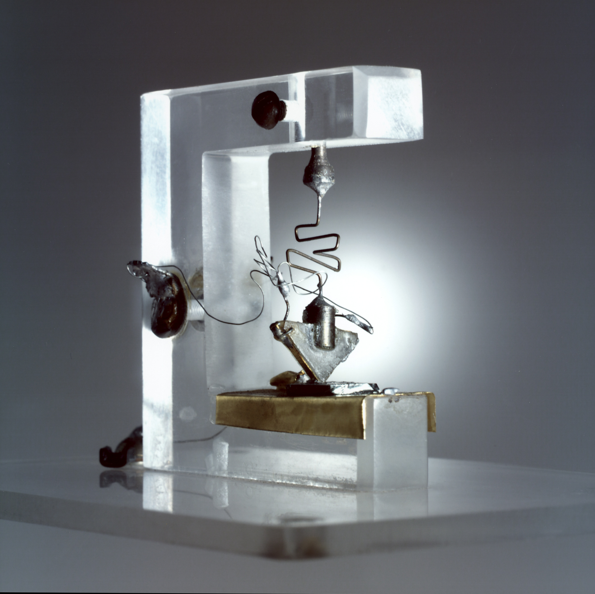

# Technopolis on Murray Hill Bell Labs: Monopoly, Research, and the Invention of the Future

## Abstract

Founded in 1925 as the research and development arm of AT&T, Bell Telephone Laboratories—commonly known as Bell Labs—became one of the most influential scientific institutions of the 20th century. From its headquarters in New Jersey, Bell Labs cultivated a culture of deep inquiry, interdisciplinary collaboration, and long-term vision that produced breakthroughs across physics, mathematics, engineering, and computing.

Among its most iconic achievements was the invention of the transistor in 1947 by John Bardeen, William Shockley, and Walter Brattain—a discovery that earned a Nobel Prize and laid the foundation for all modern electronics. Bell Labs also developed the laser, information theory (thanks to Claude Shannon), the first communication satellites, and UNIX, the powerful operating system that shaped the internet age. The C programming language, essential to modern software, was born within its walls.

Bell Labs didn’t just invent technologies—it redefined how innovation could be organized. Its model of pairing theoretical research with practical engineering became a blueprint for R&D worldwide. The lab boasted an astonishing tally of Nobel Prizes, Turing Awards, and numerous patents and scientific firsts.

Corporate restructuring and the breakup of AT&T in the 1980s changed the Labs' trajectory. Its influence, however, can be seen in nearly every digital device, fiber-optic line, and coding language we use today. More than a research lab, Bell Labs was a crucible of the information age—demonstrating how bold science, when supported and sustained, can transform the world.

## Reading and media

* [Book] *The Idea Factory: Bell Labs and the Great Age of American Innovation* by Jon Gertner 

* [Blog/opinion] [Why Bell Labs Worked](https://1517.substack.com/p/why-bell-labs-worked)

The first transistor.

---

## Prologue: The Glass Case at Murray Hill

In the lobby of the Murray Hill, New Jersey campus of what was once Bell Telephone Laboratories sits a glass case. Inside is an unremarkable slab of germanium roughly the size of a matchbook, with two triangular contacts pressed against its surface and a few paper clips holding the assembly together. It looks like something improvised in a physics lab, which in a sense it was. It is, in fact, one of the most consequential objects of the twentieth century — the original point-contact transistor, demonstrated on December 16, 1947.

Bill Gates once remarked that his "first stop on any time-travel expedition would be Bell Labs in December 1947." Fair enough. But Bell Labs does not really begin in 1947. It begins earlier: with a patent battle decided within hours, with a telephone that barely worked, and with Theodore Vail, who understood that a monopoly survives only if it keeps reinventing the system that made it powerful in the first place.

Bell Labs is one of the best places from which to study how twentieth-century technological power was actually organized.

---

## Part I: The Telephone and the Birth of an Empire (1876–1907)

### The Patent and the Man

On February 14, 1876, Alexander Graham Bell's attorney filed a patent application at the U.S. Patent Office for a method of transmitting speech electrically. Elisha Gray filed a similar caveat on the same day, arriving just hours later. Bell's patent — number 174,465 — was ultimately upheld after years of bitter litigation, establishing one of the most consequential intellectual property decisions in history.

Bell's telephone was, in many respects, more idea than instrument. The first devices were fragile, short-ranged, and prone to distortion. But the idea was explosive. Bell Telephone Company was incorporated in 1877, and Alexander Graham Bell himself, awarded the Volta Prize of 50,000 francs by the French government for his invention, used the money to establish the Volta Laboratory in Washington, D.C. — a personal research facility dedicated to improving audio and communication technologies. This was not yet Bell Labs, but it was the same spirit: a wealthy visionary investing in science to build the future.

The Bell Telephone Company became the American Telephone and Telegraph Company (AT&T) in 1885, created specifically to build long-distance telephone lines connecting cities. The patents that had made Bell a monopoly began to expire in 1894, and the flood of competitors that followed threatened to fracture the system Bell had built. By the early 1900s, hundreds of independent telephone companies were competing across the country, creating the maddening situation where a businessman in one city might need two separate phone subscriptions to call two different neighborhoods.

### Enter Vail

Into this chaos came Theodore Newton Vail, one of the most remarkable corporate executives in American history — also one of the least remembered. Vail had served as AT&T's first president in the 1880s, but he resigned in 1889 over a conflict with the company's board, who prioritized short-term dividends over long-term service investment. He spent two decades in South America building electric streetcar systems and hydropower plants before AT&T's board, in desperation, brought him back as president in 1907.

Vail returned with a philosophy that was radical for its time and still sounds unusual now. He believed the telephone was not just a product to sell but a public utility whose value depended entirely on universal reach. A telephone network that connected only wealthy urban subscribers was less valuable — to everyone, including AT&T — than one that connected every household in America. This was the doctrine that became the company's famous motto: **"One Policy, One System, Universal Service."**

What mattered most was the corollary Vail drew from this philosophy. If the telephone system was to be universal, it had to be continuously improved, and continuous improvement required continuous research. Not just product refinement. Not just incremental engineering. He wanted fundamental, long-horizon research. Vail did not want AT&T merely to improve today's telephones. He wanted a laboratory that, as management theorist Peter Drucker later described it, was "deliberately designed to make the present obsolete, no matter how profitable and efficient it is now."

The regulated monopoly structure Vail championed — trading market exclusivity for service obligations and government oversight — provided the financial architecture to make this possible. By folding a tiny fraction of every telephone call's revenue into a research budget, AT&T could fund science that no private competitor, and few governments, could match.

Vail also managed the political challenge of monopoly with remarkable sophistication. Rather than fighting regulation, he welcomed it — and worked to improve it. He managed the Kingsbury Commitment of 1913, an agreement with the Justice Department that allowed independents to interconnect with AT&T's lines in exchange for AT&T ceasing its acquisition of competitors. Vail understood that a monopoly's survival depended on its demonstrated commitment to the public good. Science was not just good business strategy. It was the proof.

Theodore Vail retired in 1919 and died in 1920. He never saw the laboratory that his vision created. But when Bell Telephone Laboratories formally incorporated on January 1, 1925, it was the culmination of everything he had built.

---

## Part II: The Idea Factory — Bell Labs in Its Golden Age (1925–1967)

### The Architecture

Bell Telephone Laboratories was jointly owned by AT&T and its manufacturing subsidiary Western Electric, and it merged the engineering research departments of both. From the beginning, it was conceived on a scale never before attempted in industrial research. By 1924, the predecessor organization already employed more than 3,600 people.

But size alone does not explain Bell Labs. What mattered was the institution's design. Physicists and engineers worked in adjacent offices and were expected to collaborate. Mathematicians were assigned to problems alongside chemists. The physical architecture of the buildings was designed to force interaction — long corridors, communal cafeterias, shared laboratories — so that a researcher with a question almost always found herself walking past someone who could answer it.

Researcher Jon Gertner, who wrote the definitive history of Bell Labs, *The Idea Factory*, captured this dynamic: a staffer with a question could seek out an expert "whether he be a mathematician, a metallurgist, an organic chemist, an electromagnetic propagation physicist, or an electron device specialist." At Bell Labs this was known as going to "the guy who wrote the book" — and it was often literally true. Many of the textbooks used in physics and engineering graduate programs in the mid-20th century were written by Bell Labs scientists.

Researchers were given unusual freedom. They were not handed product roadmaps or quarterly targets. They were hired for their intelligence and their curiosity and then told, more or less, to follow their minds. The constraint was not commercial — it was intellectual. Every project ultimately had to connect to the mission of communications, broadly defined. That was broad enough to encompass almost everything.

And crucially, Bell Labs could afford this generosity because AT&T could. The regulated monopoly meant that every American who picked up a telephone and placed a call was, without knowing it, contributing a fraction of a cent to a research fund that was mapping the universe, decoding the structure of matter, and inventing the foundations of the digital age.

### The 1920s and 1930s: The World Learns to Transmit

Bell Labs' early accomplishments established the pattern. In 1924, physicist Walter Shewhart proposed the control chart — a method for determining when a manufacturing process is out of statistical control. This would become the foundation of modern quality control methodology, including the Six Sigma process improvement framework that became ubiquitous in industry 70 years later.

In 1926, Bell Labs invented an early synchronized-sound motion picture system, helping usher in the talking picture and transforming Hollywood. In 1927, engineers achieved the first long-distance transmission of a television image. That same year, they publicly demonstrated sound-on-film synchronization.

The 1930s also produced one of Bell Labs' most improbable contributions: radio astronomy. Karl Jansky, a Bell Labs radio engineer investigating sources of static interfering with transatlantic telephone calls, discovered in 1932 that one persistent source of interference was coming from the center of the Milky Way galaxy. He had accidentally opened an entirely new field of observational science. Radio astronomy would eventually produce some of humanity's most profound cosmological discoveries — and Bell Labs would be at the center of one of them three decades later.

During this era, the lab also pioneered stereo audio recording, the first electronic speech synthesizer (the Vocoder), and one-time pad cryptography — an encryption method mathematically proven to be unbreakable when properly used, which would be employed by Allied forces in World War II.

### World War II: Science in Service of the Nation

The United States' entry into World War II reorganized Bell Labs' priorities completely. Researchers who had been studying semiconductor physics or acoustic properties were redirected to radar development, cryptography, sonar, and gun-control systems. Bell Labs contributed enormously to the radar systems that proved decisive in the Battle of Britain and the Pacific theater, and to the M-9 Gun Director, an analog computing system that dramatically improved anti-aircraft accuracy.

The wartime collaboration between Bell Labs and the military helped establish the model of public-private scientific partnership that would shape American research policy for the rest of the century. It also forced a generation of researchers to think operationally: not just what was true, but what could be made to work under pressure.

### 1947: The Transistor and the Birth of the Electronic Age

No invention better captures Bell Labs than the transistor.

By the postwar years, the telephone network was straining against a fundamental technological limitation: vacuum tubes. These glass-encased devices amplified electrical signals, but they were large, fragile, power-hungry, and short-lived. A telephone network of continental scale required thousands of them, and they failed with maddening regularity. Bell Labs' engineers understood that the next generation of the telephone system could not be built from vacuum tubes.

In 1945, Bell Labs formed a solid-state physics research group under William Shockley, a brilliant and — it must be said — difficult physicist who had done important theoretical work on semiconductor materials. The group included John Bardeen, a theoretical physicist of extraordinary depth, and Walter Brattain, an experimentalist of remarkable precision. Together, they pursued the idea that certain semiconductor materials might be made to amplify electrical signals through quantum mechanical effects — no vacuum required.

On December 16, 1947, Bardeen and Brattain demonstrated a working point-contact transistor to Bell Labs management. It worked. It could amplify a signal. It required no vacuum, consumed minimal power, generated almost no heat, and could theoretically be made very, very small.

The implications were not subtle. Bardeen, Brattain, and Shockley shared the 1956 Nobel Prize in Physics for the discovery. Bardeen went on to receive a second Nobel Prize in Physics in 1972 for a completely different achievement — the theory of superconductivity — the only person ever to accomplish this.

What made Bell Labs' handling of the transistor particularly significant, and revealing, was what happened next. AT&T could have kept the transistor proprietary, using it exclusively in its own telephone equipment and establishing an insurmountable technological moat. Instead, under legal pressure and consistent with the company's understanding of itself as a public institution, AT&T licensed transistor technology broadly, holding a symposium in 1952 at which Bell Labs scientists essentially taught the world's semiconductor engineers how to build and use transistors.

Among those who attended and learned: a young Texas Instruments engineer who would use that knowledge to co-invent the integrated circuit. Bell Labs had seeded its own competition — and catalyzed the semiconductor industry, Silicon Valley, and the entire digital revolution that followed.

### 1948: Information Theory and the Mathematical Soul of the Digital Age

One year after the transistor, Bell Labs mathematician Claude Shannon published "A Mathematical Theory of Communication" in the *Bell System Technical Journal*. It is difficult to overstate the importance of that paper.

Shannon's paper established that all information — text, sound, images, anything — could be represented as sequences of binary digits (bits), and that there was a mathematical limit to how efficiently information could be encoded and transmitted over any channel subject to noise. He invented the concept of the "bit" as the fundamental unit of information, proved the existence of error-correcting codes, and established the theoretical framework within which every digital communication system ever built has operated.

Shannon and Shockley had worked in the same building, known each other as colleagues, but at the time of their respective breakthroughs did not fully see how their work would converge. Within a decade, the connection was obvious: the transistor provided the physical substrate for manipulating bits; Shannon's information theory provided the mathematical framework for what to do with them. Together, they were the hardware and software of the information age, co-invented within twelve months of each other, in the same building, by employees of the same company.

That combination — theory, materials, engineering, deployment — is what Bell Labs was.

### The Laser, the Solar Cell, and the Satellite: The 1950s and 1960s

The postwar output was extraordinary. Even a partial list from the 1950s and 1960s makes the point:

**The Solar Cell (1954):** Physicists Gerald Pearson, Calvin Fuller, and Daryl Chapin created the first practical silicon solar cell — a photovoltaic device capable of converting sunlight directly into electricity with meaningful efficiency. The New York Times called it "the beginning of a new era." It would be four decades before solar power became commercially viable at scale, but the science was there, in Murray Hill, in 1954.

**The Laser (1958):** Bell Labs physicist Arthur Schawlow, working with Charles Townes of Columbia University, published a paper in 1958 that proposed the theoretical basis for the laser — Light Amplification by Stimulated Emission of Radiation. The concept emerged from Bell Labs' deep investment in quantum physics. While the first working laser was built at Hughes Research Laboratories in 1960, Bell Labs built the first gas laser in 1960 and would go on to develop most of the laser technologies that are now embedded in fiber optic networks, medical equipment, barcode scanners, CD players, and research instruments worldwide.

**Telstar (1962):** In collaboration with NASA, Bell Labs designed and built Telstar 1, the first communications satellite to relay live television signals across the Atlantic. When it launched in July 1962, it transmitted the first transatlantic live television broadcast, linking the United States and Europe in real time. It was a demonstration that Bell Labs' mission — universal communication — was not bounded by geography or even by the atmosphere.

**Cosmic Microwave Background Radiation (1964):** In one of the more remarkable accidental discoveries in the history of science, Bell Labs radio astronomers Arno Penzias and Robert Wilson, while trying to eliminate an inexplicable hiss from a radio antenna at the Holmdel, New Jersey facility, discovered the cosmic microwave background radiation — the faint afterglow of the Big Bang itself. They had accidentally confirmed the Big Bang theory of cosmic origin. They received the Nobel Prize in Physics in 1978.

Eleven Nobel Prizes in total have been awarded for work conducted at Bell Labs. Five Turing Awards — often called the Nobel Prize of computing — have gone to Bell Labs researchers. No other industrial laboratory has a comparable record.

---

## Part III: UNIX, C, and the Foundations of the Internet (1969–1984)

### From Multics to UNIX

By the late 1960s, computing had become central to Bell Labs' mission. The telephone network was evolving toward digital switching systems, and the lab needed sophisticated software tools to develop and test them. In 1969, after Bell Labs withdrew from a joint academic computing project called Multics (which was becoming unwieldy and overambitious), two researchers — Ken Thompson and Dennis Ritchie — took matters into their own hands.

Working in an unused PDP-7 minicomputer and driven partly by Thompson's desire to run a space travel game he had written, they created a small, elegant operating system they called UNIX. It was designed around a few powerful, philosophically consistent principles: everything is a file; programs do one thing well; programs work together by passing text between them; the system is transparent and hackable.

UNIX was not the most powerful operating system of its time. But it was the most generative. Its design philosophy — simple, composable tools that could be combined arbitrarily — would become the dominant paradigm for system software for the next half-century and beyond.

From 1969 to 1972, Ritchie developed the C programming language, initially to rewrite UNIX in a portable form. C gave programmers direct access to the hardware without surrendering the expressive power of a high-level language. It was a balance no language had achieved before, and it produced code of remarkable efficiency and portability.

The consequences were hard to overstate. AT&T, constrained by antitrust consent decrees from selling computer products commercially, was required to license UNIX to universities for a nominal fee. This seeded every major computer science department in the country with a sophisticated, production-quality operating system, and trained a generation of engineers who carried its design principles into every corner of the industry. Linux, macOS, iOS, Android, and the servers that run the internet are all, in one form or another, children of UNIX.

When the engineers who built the ARPANET — the government research network that became the internet — needed an operating system for their interconnected machines, they chose UNIX. As the ETHW (Engineering and Technology History Wiki) notes plainly, UNIX "made large-scale networking of diverse computing systems — and the internet — practical."

### The CCD and the Digital Camera

In 1969, Bell Labs physicists Willard Boyle and George Smith invented the charge-coupled device (CCD) — a semiconductor chip that converts light into electrical signals. It became the image sensor at the heart of every digital camera ever made, from the first digital telescopes on satellites to the cameras in smartphones. Boyle and Smith received the Nobel Prize in Physics in 2009 for this work.

### The Shape of the Lab at Its Peak

By the early 1970s, Bell Labs employed more than 15,000 people, including roughly 3,000 with Ph.D. degrees. By almost any measure, it was the most productive research institution private enterprise has produced. Its annual publication rate exceeded that of most major universities. Its patent output was extraordinary. Its culture — collaborative, rigorous, long-horizon, and fundamentally curious — had become a template that companies around the world tried, with mixed success, to replicate.

What enabled it all, always, was the financial architecture: an R&D tax embedded in the regulated monopoly telephone rate. Every American who paid a phone bill was, without knowing it, funding the discovery of the Big Bang and the invention of the transistor.

---

## Part IV: The Unraveling — Antitrust, Divestiture, and Decline (1974–2016)

### The System Comes Apart

By the early 1970s, the same innovations that had flowed from Bell Labs' monopoly-funded research were beginning to erode the rationale for that monopoly. Microwave transmission technology (much of it developed at Bell Labs) allowed new competitors to offer long-distance telephone service without Bell's infrastructure. The FCC's Carterfone decision of 1968 had forced AT&T to allow non-Bell equipment to connect to the network. The digital revolution was accelerating competition in ways that the regulatory framework built around Vail's 1913 model could not contain.

In 1974, the U.S. Department of Justice filed an antitrust lawsuit against AT&T. After nearly a decade of litigation, AT&T agreed in 1982 to a consent decree requiring it to divest all of its local telephone operating companies by January 1, 1984.

The divestiture — which took effect on January 1, 1984, in an event the industry called simply "the breakup" — shattered the Bell System into seven regional operating companies (the "Baby Bells") and a slimmed-down AT&T that retained long-distance service and the Bell Labs name. Almost overnight, Bell Labs lost the captive revenue streams that had funded six decades of fundamental research. The "R&D tax" built into every phone call was gone.

The consequences for research were immediate and severe. Funding contracted. Priorities shifted from long-horizon fundamental science toward product-driven applied research aligned with AT&T's competitive business units. Staff reductions, previously almost unthinkable at a place that had provided lifetime employment to its researchers, began. The best scientists, sensing the change, began to migrate to universities and other companies.

### Lucent, Alcatel, Nokia: The Long Dissolution

In 1996, AT&T undertook a second major reorganization, spinning off its equipment manufacturing and networking business into a new company called Lucent Technologies. Three-quarters of Bell Labs' staff and the Bell Labs name went with Lucent; the remainder stayed with AT&T as AT&T Laboratories.

Lucent initially thrived, buoyed by the 1990s telecommunications boom. Its stock soared, and Bell Labs enjoyed a brief resurgence of visibility and commercial relevance. But Lucent's leadership made a series of strategic missteps, prioritizing aggressive sales growth over research investment. When the dot-com bubble burst in 2000 and the telecommunications industry collapsed, Lucent was devastated. R&D funding at Lucent dropped from $2.31 billion in 2002 to $1.49 billion in 2003 — a 35% cut in a single year.

In 2006, Lucent merged with Alcatel, a French telecommunications firm, creating Alcatel-Lucent. For the first time in its history, Bell Labs was no longer in American hands. In 2016, Nokia acquired Alcatel-Lucent, and Bell Labs became a division of a Finnish company focused on 5G and network infrastructure. It still exists, still bears the name, still employs talented researchers working on wireless and networking problems. But the institution that discovered the structure of the universe by accident while trying to reduce telephone static is gone. The cathedral was sold for parts.

### Why It Couldn't Last

Bell Labs in its classic form raises an obvious question: can such an institution be built again? If not, why not?

The answer starts with structure. Bell Labs worked because it was funded like a public institution while organized as a private one. The regulated monopoly's captive revenue stream gave it the financial stability of a university endowment combined with the organizational coherence of a focused corporate mission. Researchers had job security, long time horizons, excellent colleagues, and a connection to a real-world problem domain that grounded their work without constraining it.

When AT&T became a competitive company, that structure collapsed. Competitive companies cannot afford to fund research whose fruits may take decades to appear, whose results must be freely shared with the industry (as Bell Labs' patents often were, by antitrust decree), and whose greatest discoveries — like the transistor or information theory — are so fundamental that their primary commercial beneficiary might be a competitor not yet founded.

As IEEE Spectrum observed in its post-mortem on AT&T, the company had "effectively diverted a tiny fraction of our everyday expenses — and from all corners of the country — into a research fund whose returns were shared with all of humanity." When that sharing became incompatible with the logic of competition, the funding disappeared. The discovery of the Big Bang's afterglow was a byproduct of a telephone company's attempt to build a better antenna. No company operating under competitive market pressure would fund such work. And no government, historically, has shown the ability to fund it with the same combination of freedom, focus, and long-term consistency.

---

## Part V: Who Comes Next? — Innovation in the 21st Century

### The Landscape Has Fractured

Bell Labs was singular partly because it was unified. It brought together, in one institution, researchers working simultaneously on physics, chemistry, mathematics, engineering, and computer science, all loosely organized around a common mission. The knowledge generated in one corner of the lab — quantum mechanics, semiconductor physics — could flow directly to the engineers building systems in another. This cross-pollination was not incidental; it was designed.

The twenty-first-century innovation system looks almost like the inverse: fragmented, fast, competitive, and siloed. The great technology companies — Google, Apple, Microsoft, Amazon, Meta — conduct enormous amounts of research and produce genuine breakthroughs. But their research agendas are shaped, ultimately, by the products they need to build and the markets they need to serve. The time horizons are shorter. The sharing is more restricted. The serendipitous wandering across disciplinary lines is harder when researchers are assigned to specific product teams with specific roadmaps.

This is not moral criticism. It is structural description. The criticism, if any, belongs to the question of whether the market structure of the 21st century leaves room for the kind of institution Bell Labs was.

### AI Labs as Partial Heirs

The closest thing today, at least in some respects, is the cluster of AI research labs that emerged over the past decade: Google DeepMind, OpenAI, Anthropic, and Meta AI.

Like Bell Labs, these organizations are concentrating exceptional talent from across disciplines — mathematics, computer science, neuroscience, linguistics, physics — and giving them access to resources (in this case, compute rather than laboratory equipment) at a scale no university can match. Like Bell Labs, they are pursuing research whose implications extend far beyond any specific product. Like Bell Labs, their most fundamental discoveries — the transformer architecture, scaling laws, reinforcement learning from human feedback, mechanistic interpretability — have spread rapidly through the entire research community, often through the publication of papers, sometimes through open-source releases of code and models.

Google DeepMind has been particularly striking in this regard. Its AlphaFold system, which in 2020 solved the protein structure prediction problem that had resisted biochemists for 50 years, may prove to be among the most consequential scientific achievements of the 21st century. The system was subsequently made freely available, with a database of predicted structures for hundreds of millions of proteins. This is precisely the kind of broadly shared, civilizationally significant basic research that Bell Labs was known for — and DeepMind did it under the umbrella of an advertising company with a mission to organize the world's information.

Anthropic and OpenAI have both published foundational work in AI alignment, interpretability, and the science of large language models. The scaling laws paper published by Jared Kaplan and colleagues in 2020 — showing that model capability increases predictably with compute, data, and parameters — is arguably the most important empirical result in AI research of the past decade, analogous in its structuring effect on the field to Shannon's information theory.

Yet there are important ways in which even the best AI labs diverge from the Bell Labs model. The time horizon is shorter. The commercial pressure is higher. The race dynamics between competing labs create incentives to publish selectively, to withhold capabilities, and to prioritize competitive advantage over open scientific exchange. Bell Labs researchers did not worry that a paper on semiconductor physics might help Western Electric's competitors — because, under antitrust decree, they were often required to share everything anyway. AI labs operate in a world where a training recipe or a safety technique might represent billions of dollars in competitive value.

There is also the question of domain. Bell Labs covered physics, chemistry, mathematics, computer science, astronomy, and materials science simultaneously. The AI labs, impressive as they are, are focused — deeply, brilliantly focused — on a single technological paradigm. The discoveries they are making are profound, but they are discoveries within a field, not the simultaneous invention of multiple fields.

### Other Contenders

Beyond the AI labs, several other institutions deserve mention in any honest survey of 21st-century basic research.

**Microsoft Research**, founded in 1991 and still active, has been a serious contributor to computer science, from advances in programming languages and distributed systems to quantum computing research. It lacks the cross-disciplinary sweep of Bell Labs but has maintained a genuine commitment to publication and academic collaboration that distinguishes it from most corporate R&D operations.

**The Chan Zuckerberg Initiative, the Wellcome Trust, the Gates Foundation, and similar philanthropic science funders** represent an attempt to replicate Bell Labs' most crucial structural feature — stable, long-horizon funding not subject to competitive market pressure — using private philanthropy rather than a regulated monopoly tax. These institutions have made genuine contributions, particularly in biomedical research, but they are organized around specific mission areas rather than the comprehensive basic science mandate that Bell Labs carried.

**DARPA** — the Defense Advanced Research Projects Agency — has been, since its founding in 1958 in response to Sputnik, perhaps the most effective government-funded institution for catalyzing breakthrough research in the United States. ARPANET, GPS, the internet's packet-switched architecture, stealth aircraft, and much of the foundational work in AI and robotics have DARPA fingerprints. DARPA's model — small program offices, high-risk bets, rapid iteration, deep collaboration with universities and industry — is a genuinely distinctive approach to government-funded innovation that has no direct parallel elsewhere. But DARPA's portfolio is shaped by national security priorities, and its most fundamental discoveries tend to flow through university collaborators rather than being generated internally.

**Universities themselves** continue to do irreplaceable basic research. The transformer architecture that underlies modern AI emerged largely from Google Brain and academic collaborations. CRISPR gene editing was developed at the Broad Institute and UC Berkeley. Fundamental advances in quantum computing come from MIT, Caltech, IBM, and academic labs worldwide. The university system, for all its inefficiencies, remains the most consistent engine of basic scientific discovery in the world — but it lacks the organizational coherence and cross-disciplinary integration that made Bell Labs more than the sum of its parts.

### The SpaceX/Tesla Model: Mission-Driven Moonshots

A different kind of heir to the Bell Labs spirit may be found in the mission-driven technology companies of the 21st century — companies organized not around a market opportunity but around a civilizational goal. SpaceX's mission to make humanity multiplanetary, Tesla's drive to accelerate the transition to sustainable energy, or Neuralink's ambition to create brain-computer interfaces share with Bell Labs a willingness to make extraordinarily long-horizon investments in service of goals that transcend any particular product cycle.

These companies do not conduct the kind of open, publication-oriented basic research that characterized Bell Labs at its peak. Their science is proprietary and competitive. But the structural logic — concentrated talent, long time horizons, genuine ambition — echoes something of the Bell Labs approach, even if the outputs are systems rather than papers.

### Anthropic and the Safety-First Research Institution

Anthropic represents a particularly interesting case. Founded in 2021 by former OpenAI researchers who disagreed about the pace and prioritization of AI safety work, it has staked its institutional identity on a research agenda whose payoff is explicitly civilizational rather than commercial: understanding how to build AI systems that are safe, interpretable, and reliably aligned with human values.

This is genuinely basic research in a sense Bell Labs would have recognized. The questions Anthropic's mechanistic interpretability team is asking — what computations is this neural network actually performing? where are the circuits that implement reasoning? how do we locate and understand the representations of concepts inside a model? — are scientific questions of the deepest kind, with no guaranteed commercial payoff and implications that extend to every AI system ever built. Claude Shannon would have found them fascinating.

Whether Anthropic can sustain this commitment as commercial pressures intensify remains to be seen. The structural problem — that a competitive company cannot indefinitely subsidize basic research whose fruits benefit everyone — is the same problem that undid Bell Labs after 1984. Anthropic does not have a monopoly telephone tax to draw upon. It has venture capital and product revenue, which are less forgiving of long time horizons and freely shared discoveries.

---

## Epilogue: What We Lost and What We Need

One reading of Bell Labs is triumphant: an institution that did exactly what it set out to do. By every measure of scientific output, it succeeded beyond any reasonable expectation. Eleven Nobel Prizes. Five Turing Awards. The transistor. The laser. Information theory. UNIX. The CCD. Radio astronomy. The discovery of the Big Bang's afterglow.

Another reading is less celebratory and more useful: Bell Labs shows how fragile the underlying institutional conditions really were. Bell Labs worked because Theodore Vail convinced the American government and public that a regulated monopoly in service of universal communication was in everyone's interest, and that the monopoly's obligation to the public extended to funding the science that would eventually make it obsolete. When the monopoly ended, the funding logic collapsed, and the institution dissolved in stages over the following three decades.

The twenty-first century has not produced another Bell Labs. It has produced many brilliant things — the internet, smartphones, GPS, CRISPR, mRNA vaccines, large language models — but it has produced them through a different kind of ecosystem: competitive, fast, fragmented, commercially driven. The research that underlies these breakthroughs often still happens in universities, in government labs, in small research groups pursuing questions that no market would fund. But the organizing institution — the place where physicists and mathematicians and engineers and chemists worked in adjacent offices and talked to each other every day about problems that existed at the intersection of their disciplines — has not been rebuilt.

Perhaps it cannot be. The Bell Labs model required a very specific economic structure — a regulated natural monopoly with a public interest mandate and an antitrust regime that forced broad technology licensing — that no longer exists and probably cannot exist in the same form. The AI labs are important institutions doing important science. But they are not Bell Labs.

What they may represent is an opening chapter in a different model, one that still has not found a stable institutional form. The question the 21st century will have to answer is whether societies can design the institutional structures that allow long-horizon, cross-disciplinary, freely shared basic research to be funded and conducted at scale without a telephone monopoly to pay for it. It is not obvious that market mechanisms can produce such an institution on their own. It is not obvious that governments can either.

Bell Labs was, in the end, an historical exception: a byproduct of a particular regulatory bargain, a particular technological moment, and leaders who understood that the most commercially productive thing an institution can sometimes do is to make commercial logic secondary. Alexander Graham Bell built the telephone. Theodore Vail built the system that made it universal. And the system, for six extraordinary decades, built everything else.

The glass case in Murray Hill is still there. So is the germanium slab. The harder question is whether anyone now is building with a sixty-year horizon.

---

## Selected Timeline of Bell Labs Milestones

| Year | Achievement |
|------|-------------|
| 1876 | Alexander Graham Bell patents the telephone |
| 1907 | Theodore Vail returns to AT&T; articulates "universal service" |
| 1915 | First transcontinental telephone call |
| 1925 | Bell Telephone Laboratories formally incorporated |
| 1924 | Walter Shewhart proposes statistical process control (origin of Six Sigma) |
| 1927 | First long-distance television transmission |
| 1932 | Karl Jansky discovers radio waves from the Milky Way; founds radio astronomy |
| 1936 | First electronic speech synthesizer (Vocoder) |
| 1947 | Transistor invented (Bardeen, Brattain, Shockley) — Nobel Prize 1956 |
| 1948 | Claude Shannon publishes "A Mathematical Theory of Communication" |
| 1954 | First practical silicon solar cell |
| 1958 | Laser concept published (Schawlow and Townes) |
| 1962 | Telstar 1 — first communications satellite to relay live TV |
| 1964 | Cosmic microwave background radiation discovered — Nobel Prize 1978 |
| 1969 | UNIX operating system created (Thompson and Ritchie) |
| 1969 | CCD (charge-coupled device) invented — Nobel Prize 2009 |
| 1972 | C programming language developed |
| 1979 | First single-chip digital signal processor |
| 1984 | AT&T breakup; Bell Labs funding begins to contract |
| 1996 | Bell Labs spun off with Lucent Technologies |
| 2006 | Lucent merges with Alcatel |
| 2016 | Nokia acquires Alcatel-Lucent; Bell Labs becomes Nokia Bell Labs |

---

*Sources consulted include: Jon Gertner, The Idea Factory: Bell Labs and the Great Age of American Innovation (2012); Nokia Bell Labs historical archives; Bell System Memorial; IEEE Spectrum; ETHW (Engineering and Technology History Wiki); Wikipedia Bell Labs. Additional sources listed below.*

*   **"An Outline of the History of the Transistor"** (Transistorized!). PBS Online. Includes contributions from ScienCentral, Inc. and the American Institute of Physics.
*   **"Bell Labs."** Wikipedia, The Free Encyclopedia. Last edited March 2, 2026.
*   **Genkina, Dina.** "Bell Labs Turns 100, Plans to Leave Its Old Headquarters." *IEEE Spectrum*. April 18, 2025.
*   **Gorman, Michael E.** "Alexander Graham Bell's Path to the Telephone." SEAS, University of Virginia.
*   **"Inside the Birthplace of Your Favorite Technology."** *The New York Times*.
*   **Ione, Amy.** Review of *The Idea Factory: Bell Labs and the Great Age of American Innovation* by Jon Gertner. *Leonardo Reviews*, MIT Press.
*   **"John Bardeen."** Wikipedia, The Free Encyclopedia. Last edited March 21, 2026.
*   **"Traitorous eight."** Wikipedia, The Free Encyclopedia. Last edited February 3, 2026.
*   **"Walter Brattain."** Wikipedia, The Free Encyclopedia. Last edited February 23, 2026.
*   **"What are the Bell Labs of today?"** Reddit, r/AskEngineers.
*   **"William Shockley."** Wikipedia, The Free Encyclopedia. Last edited March 16, 2026.

*Original draft by Leo Irakliotis. Grammatical edits and readability improvements by chatGPT. Final review by Leo.*